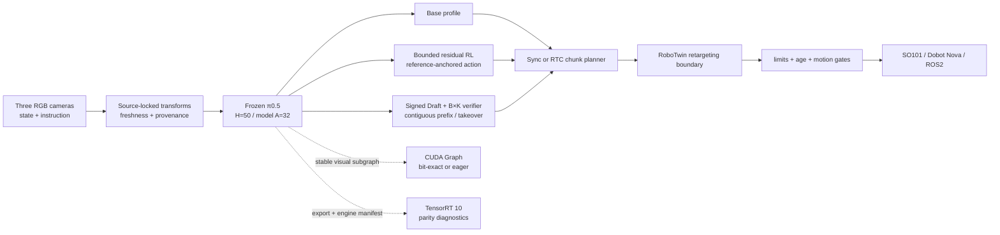

<div align="center">

# Fibocom π0.5 VLA Stack — Built on RLinf

### Frozen-Backbone Residual RL · Continuous-Action Speculative Inference · CUDA/TensorRT Diagnostics · RTC · Robot Adapters

[](requirements/fibocom_vla_quickstart.sh)
[](requirements/fibocom_vla_quickstart.txt)
[](docs/fibocom_vla_evidence/claim_boundary.md)
[](docs/fibocom_vla_evidence/quickstart_validation_20260826.md)
[](LICENSE)

[简体中文](README_ZH.md) · [Full implementation guide](examples/embodiment/fibocom_vla/README.md) · [Quick Start evidence](docs/fibocom_vla_evidence/quickstart_validation_20260826.md) · [Claim boundary](docs/fibocom_vla_evidence/claim_boundary.md) · [Upstream RLinf](https://github.com/RLinf/RLinf)

</div>

> [!IMPORTANT]
> This branch is an experimental VLA research adaptation built on **RLinf**; it is not presented as an official RLinf or Fibocom release. Its highest defensible repository label is `component-verified`, while the fresh-clone CPU path is a `runnable-smoke`. The résumé success-rate and latency/speedup figures, a trained and promoted π0.5 Draft, a π0.5 TensorRT engine, and SO101/Nova physical execution are **not reproduced here**. Execution evidence is commit-bound; see the [claim-to-evidence boundary](docs/fibocom_vla_evidence/claim_boundary.md).

---

## Overview

This project organizes a source-locked RLinf π0.5 RoboTwin policy into an auditable post-training and deployment stack. It studies and implements mechanisms for two practical embodied-foundation-model bottlenecks: adapting a pretrained policy from bounded closed-loop experience without changing its base weights, and building lower-latency continuous-action VLA serving paths without erasing numerical, model-lineage, or robot-safety boundaries. Whether those mechanisms improve task quality or latency must be established by the separate evaluation gates below.

Core design decisions:

- **The π0.5 backbone remains frozen.** A bounded 1,819,897-parameter residual actor makes local H=50/A=14 action corrections; the value head and Twin-Q critic remain separate.
- **Publisher bytes and runtime contracts are not conflated.** The checkpoint metadata says H=10; the repository separately binds the registered RLinf H=50 runtime, transforms, normalization statistics, cameras, and SHA-256 manifest without rewriting the weights.
- **Acceleration paths fail closed.** CUDA Graph is limited to eligible shape-stable visual subgraphs and requires a bit-exact gate; ineligible or mismatched inputs return to eager execution.
- **Draft promotion requires new evidence.** Published π0 LIBERO Draft heads may initialize a π0.5 Draft, but cannot enter production without checkpoint-bound training, evaluation, and approval.
- **Robot semantics change only at reviewed adapter boundaries.** Dual-Aloha H50×14 output is never silently relabelled as SO101-6D or Nova-7D commands.

## Architecture



Base, residual-RL, and speculative profiles are alternative policy paths; they are not automatically composed. Residual and speculative modes are deliberately mutually exclusive because a Draft approval is bound to the exact frozen main-policy contract. CUDA Graph and TensorRT are optional deployment paths, while RTC overlaps chunk generation with execution and preserves already committed prefixes.

## Implemented components

| Subsystem | Current implementation | Verified boundary |
|---|---|---|
| **Residual RL post-training** | Frozen π0.5 reference, 1,819,897-parameter bounded actor, separate V head and Twin-Q auxiliary critic, chunk-outcome transform, trajectory GAE, one-epoch PPO, rollout/checkpoint lineage | Geometry and training plumbing are component-tested; no new policy-quality or 112-trajectory result |
| **CUDA Graph / TensorRT** | Reversible PaliGemma vision-tower/projector capture with bit-exact gate and eager fallback; TensorRT 10 manifest, builder/runtime, parity, ULP and layer-difference diagnostics | An older synthetic CUDA Graph smoke is bound to `fb0d04a8`; no checkpoint-bound π0.5 graph latency or TensorRT engine result |
| **Speculative inference** | Strict Draft asset loader, OpenPI single-prefill B×K verifier, contiguous-prefix acceptance, same-round main takeover, Torch/Triton post-processing, signed promotion gate | Gated factory path and fixtures tested; no trained/evaluated/signed production π0.5 Draft or paired benchmark |
| **RTC** | Asynchronous chunk planner, committed-prefix hard freeze, model-space overlap VJP, exponentially decaying guidance and separate timing clocks | An older synthetic CUDA VJP smoke is bound to `fb0d04a8`; no OpenPI or robot end-to-end timing/quality result |
| **Robot integration** | SO101, Dobot Nova TCP, ROS2 joint control, OpenCV/RealSense/ROS2 cameras, synchronized observations and strict H50×14 retargeting interfaces | Adapters and locked templates tested; task FK/IK, gripper mapping, calibration and physical validation pending |

## Frozen runtime contract

| Field | Source-locked value |
|---|---|
| Implementation base | `RLinf release/v0.2@46213e88caa910a4a52e68bde4fb96416c1efa55` |
| Main checkpoint | `RLinf/RLinf-Pi05-RoboTwin-SFT-adjust_bottle@fa8df6ed103db0f5549c122f3a17c00ba6426c98` |
| Registered runtime | `pi05_aloha_robotwin`, H=50 |
| Normalization | `physical-intelligence/robotwin`, quantile normalization |
| Geometry | Raw state/action: 14; normalized model state/action: 32 |
| Cameras | `cam_high`, `cam_left_wrist`, `cam_right_wrist` |
| Residual actor | H=50, A=14, hidden=447, exactly 1,819,897 trainable parameters |
| Published Draft source | `Dexmal/RealtimeVLA-Flash@77b9a6f88fb100230bc78cb4cb361bd2e586f9fb` — π0 LIBERO only; π0.5 warm-start only |
| CPU Quick Start | Python 3.11.14, PyTorch 2.6.0+cpu, 32 pinned requirement entries |

The publisher `config.json` records H=10. This repository does not alter those bytes. It verifies the original asset set and separately attests the registered H=50 RLinf runtime, official RoboTwin YAML, Aloha transforms, normalization statistics, camera mapping, and state/action geometry.

## Run immediately after cloning

The commands after source checkout are the verified CPU-only path for Ubuntu/WSL2 x86_64. They need Git, Bash, `python3` with `pip`, and network access, but do **not** require CUDA, model weights, RoboTwin, ROS2, or a robot SDK. The `git clone` lines below use the canonical GitHub transport; reachability still depends on the user's network. Run the complete block from a Bash shell when GitHub is reachable, or obtain the exact branch through an approved compatible transport and continue from the repository root:

```bash
git clone --branch feat/fibocom-vla-stack --single-branch \
  https://github.com/xlr1012514182/RLinf.git
cd RLinf

bash requirements/fibocom_vla_quickstart.sh

.venv-fibocom/bin/python -m rlinf.projects.fibocom_vla.cli validate-config \
  --config examples/embodiment/fibocom_vla/config/robotwin_pi05_h50_dry_run.json

.venv-fibocom/bin/python -m rlinf.projects.fibocom_vla.cli mock-smoke \
  --config examples/embodiment/fibocom_vla/config/mock.json --steps 16

.venv-fibocom/bin/python -m pytest -q tests/unit_tests/projects/fibocom_vla
```

The bootstrap creates a repository-local `.venv-fibocom`, pins Python 3.11.14 and CPU dependencies, and requires no shell activation. The recorded 2026-08-26 run validated H=50/A=14, completed 16 control steps in two chunks with `stop_reason=maximum_control_steps`, and reported **317 passed, 5 skipped**. These signals validate configuration, Mock runtime, and component plumbing only. See the [fresh-clone record](docs/fibocom_vla_evidence/quickstart_validation_20260826.md) for the tested commit, hashes, environment, and network-transport caveat.

## Post-training and deployment paths

The repository exposes implementation entry points but does not bundle model weights, training data, TensorRT engines, or hardware credentials:

| Path | Repository entry | External requirements and remaining gate |
|---|---|---|
| Residual post-training | `rlinf/projects/fibocom_vla/rl/train_cli.py` | Operator-supplied immutable base-model identity/revision (recorded but not independently loaded or hashed by this CLI), real rollout archive, behavior-checkpoint lineage and a fixed evaluation protocol |
| π0.5 Draft training/promotion | `rlinf/projects/fibocom_vla/draft_train_cli.py` | Main-model-owned teacher cache, real train/validation split, optimizer run, held-out evaluation and independent signed approval |
| Main/OpenPI runtime | `rlinf/projects/fibocom_vla/factories.py` | Downloaded and SHA-256-verified checkpoint assets plus the exact transform/config contract |
| CUDA Graph / TensorRT | `rlinf/projects/fibocom_vla/inference/` | Compatible NVIDIA environment; π0.5 export, engine build, parity and paired timing evidence before enablement |
| Physical runtime | `rlinf/projects/fibocom_vla/hardware/` | Reviewed SDK endpoints, joint semantics, calibration, retargeting/FK/IK, limits, timestamps, stop behavior and supervised motion approval |

Use the [full implementation guide](examples/embodiment/fibocom_vla/README.md) for asset verification, dry-run, training and deployment commands. Placeholder paths in that guide must be replaced with locally verified assets; they are not part of the clone-and-run CPU path.

## Robot and ROS2 integration

The hardware layer provides fail-closed interfaces for LeRobot SO101, Dobot Nova TCP/IP V4, generic ROS2 `JointState`/`JointTrajectory`, OpenCV, RealSense and ROS2 cameras. The dedicated retargeting boundary keeps the model contract at dual-Aloha H50×14 and accepts only an explicitly reviewed engine returning H50×6 SO101 or H50×7 Nova absolute targets.

Every checked-in real-robot template remains `dry_run=true` or motion-locked. Before any physical write, users must supply and review device identities, SDK/topic/service endpoints, joint order and units, limits, camera calibration and timing, task-specific FK/IK and gripper conversion, a matching calibration ID, feedback freshness, acknowledged stop/emergency-stop behavior, and a supervised bounded-motion protocol. Changing a single Boolean cannot authorize motion.

## Repository layout

```text
rlinf/projects/fibocom_vla/
├── rl/          residual actor, reward transform, GAE/PPO, rollout and checkpoint lineage
├── inference/   CUDA Graph, TensorRT, Draft/verifier, Triton and RTC paths
├── runtime/     synchronized control loop, async chunk planner and lifecycle
├── hardware/    SO101, Dobot, ROS2, cameras, policy adapters and retargeting
├── assets.py    main-checkpoint manifest and transform verification
├── factories.py fail-closed policy/runtime assembly
└── cli.py       validation, asset checks, actor reports and bounded smoke/run entry points

examples/embodiment/fibocom_vla/   full guides, source-locked assets and safe configs
requirements/fibocom_vla_quickstart.*  pinned CPU clone-and-run environment
tests/unit_tests/projects/fibocom_vla/ component and fail-closed contract tests
docs/fibocom_vla_evidence/         source locks, matrices, logs and claim boundaries
```

## Evidence

| Area | Verified | Not established | Record |
|---|---|---|---|
| Fresh-clone CPU | Bootstrap, H=50/A=14 config, 16-step/two-chunk Mock loop, 317 passed and 5 skipped at `627f5300` | OpenPI weights, CUDA, ROS2 or hardware | [Quick Start validation](docs/fibocom_vla_evidence/quickstart_validation_20260826.md) |
| Main checkpoint | All 17 declared assets authenticated; one seed-17 synthetic three-camera H=50 CUDA forward, finite `[50,14]` environment action and `[50,32]` model action at `b75f92b4` | Task quality, latency, throughput, simulator success or robot compatibility | [Remote checkpoint validation](docs/fibocom_vla_evidence/remote_validation_20260826.md) |
| Residual RL | Exact actor geometry plus frozen-base, reward/GAE/PPO, rollout and checkpoint-lineage tests | 112 pure self-rollouts, 75.0%→96.9%, drop reduction or any new policy-quality result | [Claim boundary](docs/fibocom_vla_evidence/claim_boundary.md) |
| CUDA Graph / RTC | Older commit-bound (`fb0d04a8`) bit-exact synthetic CUDA Graph and finite synthetic VJP/prefix-freeze smokes | Checkpoint-bound 48.2→42.8 ms, RTC 5.6 s→4 ms, OpenPI or robot timing | [Reproduction matrix](docs/fibocom_vla_evidence/reproduction_matrix.csv) |
| Speculative / TensorRT | Strict loaders, manifests, factory gates, numerical references and diagnostic protocols tested | Production π0.5 Draft, π0.5 engine, 3.04×/1.5× speedups or paired task quality | [Claim boundary](docs/fibocom_vla_evidence/claim_boundary.md) |
| Hardware | SDK/API adapters, synchronized Mock lifecycle, freshness/safety checks and locked H50 retargeting contracts | Calibration, firmware/endpoint validation, physical E-stop behavior or robot motion | [Claim boundary](docs/fibocom_vla_evidence/claim_boundary.md) |

The evidence records intentionally separate implementation capability, authenticated assets, synthetic smokes, upstream results, and reproduced task measurements. A code path, an upstream number, and a reproduced result are three different claims.

---

## Upstream lineage and references

| Source | Audited revision | Role in this branch |
|---|---|---|
| [RLinf](https://github.com/RLinf/RLinf) | `release/v0.2@46213e88` | Implementation base and RL/OpenPI conventions |
| RLinf main | `12881eda` | Source-locked comparison for current π0.5 RoboTwin config, transforms and dependency pins; this branch is not presented as a full rebase |
| [FlashRT](https://github.com/flashrt-project/FlashRT) | `f72192b2` | CUDA Graph/exactness and RTC runtime design audit |
| [realtime-vla-flash](https://github.com/dexmal/realtime-vla-flash) | `da6cecca` | Continuous-action Draft, verification, prefix and fallback design audit |
| [RLinf π0.5 RoboTwin weights](https://huggingface.co/RLinf/RLinf-Pi05-RoboTwin-SFT-adjust_bottle) | `fa8df6ed` | Source-locked main asset; not redistributed by this repository |
| [RealtimeVLA-Flash Draft weights](https://huggingface.co/Dexmal/RealtimeVLA-Flash) | `77b9a6f8` | π0 LIBERO asset; initialization-only for the π0.5 target |

## License

Code in this branch follows the parent project's [Apache-2.0 License](LICENSE). Optional robot SDKs, downloaded checkpoints, datasets, and external source trees remain subject to their own licenses and redistribution terms. This repository does not redistribute or relicense third-party model weights.
