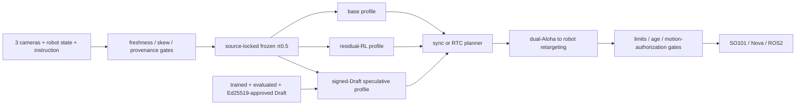

# Fibocom π0.5 VLA Post-Training & Runtime Stack

[English](README.md) | [简体中文](README_ZH.md)

**Frozen-base residual RL · continuous-action speculative inference · CUDA/TensorRT diagnostics · RTC · fail-closed robot integration**

> This is an independent engineering extension built on
> [RLinf `release/v0.2`](https://github.com/RLinf/RLinf/tree/release/v0.2)
> at upstream commit `46213e88`. It is not an official RLinf release or an
> upstream benchmark. The parent project, source revisions, third-party model
> assets, and reproduced evidence remain explicitly separated.

This branch turns a source-locked RLinf π0.5 RoboTwin policy into an auditable
post-training and deployment stack. Its focus is not a demo-only happy path: a
checkpoint, transform, Draft, robot mapping, or motion authorization mismatch
fails closed before it can silently change policy semantics.

## What is implemented

| Workstream | Implementation | Current boundary |
|---|---|---|
| **Residual RL post-training** | frozen π0.5 reference policy, 1,819,897-parameter bounded residual actor for H=50/A=14, independent value head, twin-Q auxiliary loss, trajectory GAE, one-epoch PPO, rollout/checkpoint lineage | component-verified; reported physical-task improvement is not reproduced here |
| **CUDA Graph / TensorRT** | factory-wired visual-tower/projector graph capture with bit-exact gate and eager fallback; TensorRT 10 build/runtime manifest, parity, ULP and layer-diff diagnostics | contracts verified; no checkpoint-bound π0.5 TensorRT engine or latency claim |
| **Speculative inference** | signed π0.5 Draft gate, one-prefill B×K OpenPI verifier, contiguous-prefix acceptance, same-round full-main takeover, Torch/Triton post-processing | production assembly exists; no trained/evaluated/signed π0.5 Draft is shipped |
| **RTC** | asynchronous chunk planning, committed-prefix hard freeze, model-space overlap VJP guidance, exponentially decayed weights, separated timing clocks | synthetic component-verified; checkpoint/robot timing pending |
| **Robot integration** | SO101, Dobot Nova, ROS2 and camera backends; strict dual-Aloha H50×14 to SO101-6D/Nova-7D retargeting boundary | adapters and locked templates verified; task-specific engine, calibration and physical motion pending |

## Source-locked model target

| Field | Contract |
|---|---|
| Main weights | `RLinf/RLinf-Pi05-RoboTwin-SFT-adjust_bottle@fa8df6ed103db0f5549c122f3a17c00ba6426c98` |
| Registered runtime | `pi05_aloha_robotwin`, H=50 |
| Statistics | `physical-intelligence/robotwin`, quantile normalization |
| Geometry | raw state/action 14; normalized model state/action 32 |
| Cameras | `cam_high`, `cam_left_wrist`, `cam_right_wrist` |
| Draft source | `Dexmal/RealtimeVLA-Flash@77b9a6f8`; π0 LIBERO only, warm-start-only for this π0.5 target |

The publisher checkpoint metadata records H=10. This repository does not edit
those bytes: it verifies them and separately binds the RLinf registered H=50
runtime, official RoboTwin YAML, normalization statistics, camera mapping, and
Aloha transforms through SHA-256/source fingerprints.

## Current verification status

The sealed implementation baseline is `b75f92b4`:

| Gate | Result |
|---|---|
| Local Windows/Python 3.10 suite | **322 collected, 317 passed, 5 skipped, 2 warnings** |
| Remote Linux suite | **321 passed, 1 skipped** |
| Main checkpoint manifest | complete fixed-revision file hashes and transform/runtime contract verified |
| Main checkpoint H=50 forward | **passed** for one seeded synthetic observation: 3,616,757,520 parameters, exact main backbone, classified auxiliary value head, environment `[50,14]`, model `[50,32]`, finite outputs |
| Physical robot / simulator task quality | not run under a claim-grade paired protocol |

The strict load report has zero missing and zero unresolved unexpected main-model
keys. It preserves all eight full-FP32 RLinf training value-head keys in the raw
report and explicitly classifies them as an ignored auxiliary head; this is not
the same as silently relaxing the main-backbone load. The smoke used seed 17 and
one synthetic observation. It proves bounded load/transform/forward plumbing,
not latency, throughput, simulator success, or robot-task quality.

Older CUDA numbers in the evidence directory are isolated synthetic component
measurements. The résumé values—75.0%→96.9%, 48.2→42.8 ms, TensorRT 1.5×,
58.0→19.1 ms, and RTC 5.6 s→4 ms—are historical, upstream, or target claims;
they are not presented as results reproduced by this branch.

## Architecture



Residual and speculative profiles are intentionally mutually exclusive: a
Draft verifier signed for the exact frozen main policy cannot authorize a
residual-modified action policy. Nonlinear single-arm retargeting also disables
native RTC because its inverse model-space mapping is not guaranteed.

## Safe quick start

```bash
bash requirements/install.sh embodied --model openpi --env robotwin --install-rlinf

python -m rlinf.projects.fibocom_vla.cli validate-config \
  --config examples/embodiment/fibocom_vla/config/robotwin_pi05_h50_dry_run.json

python -m rlinf.projects.fibocom_vla.cli mock-smoke \
  --config examples/embodiment/fibocom_vla/config/mock.json --steps 16

python -m pytest -q tests/unit_tests/projects/fibocom_vla
```

The checked-in SO101/Nova configurations are deliberately motion-locked. They
do not become safe merely by changing `dry_run`: a reviewed retargeting engine,
matching calibration identity, physical limits, endpoints, feedback, explicit
`--allow-motion`, and supervised staged validation are all required.

## Documentation and evidence

- [Full English implementation guide](examples/embodiment/fibocom_vla/README.md)
- [中文实现指南](examples/embodiment/fibocom_vla/README_ZH.md)
- [Claim-to-evidence boundary](docs/fibocom_vla_evidence/claim_boundary.md)
- [Reproduction matrix](docs/fibocom_vla_evidence/reproduction_matrix.csv)
- [Pinned source identities](docs/fibocom_vla_evidence/source_lock.json)
- [Current local validation record](docs/fibocom_vla_evidence/local_validation_20260826.md)
- [Current remote validation record](docs/fibocom_vla_evidence/remote_validation_20260826.md)
- [Sealed main-checkpoint smoke JSON](docs/fibocom_vla_evidence/remote_b75f92b4/openpi_checkpoint_smoke_b75f92b4.json)

## Upstream lineage and license

The implementation base is the official [RLinf repository](https://github.com/RLinf/RLinf).
Selected current-RLinf OpenPI/RoboTwin contracts are source-locked separately
and listed in the detailed guide. Code in this branch follows the parent
[Apache-2.0 license](LICENSE). Third-party checkpoints retain their own terms;
this repository does not redistribute or relicense their weights.
