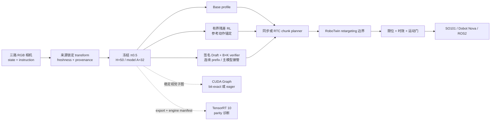

<div align="center">

# Fibocom π0.5 VLA Stack — Built on RLinf

### 冻结基座残差 RL · 连续动作 Speculative Inference · CUDA/TensorRT 诊断 · RTC · 机器人适配

[](requirements/fibocom_vla_quickstart.sh)
[](requirements/fibocom_vla_quickstart.txt)
[](docs/fibocom_vla_evidence/claim_boundary.md)
[](docs/fibocom_vla_evidence/quickstart_validation_20260826.md)
[](LICENSE)

[English](README.md) · [完整实现指南](examples/embodiment/fibocom_vla/README_ZH.md) · [Quick Start 证据](docs/fibocom_vla_evidence/quickstart_validation_20260826.md) · [声明—证据边界](docs/fibocom_vla_evidence/claim_boundary.md) · [上游 RLinf](https://github.com/RLinf/RLinf)

</div>

> [!IMPORTANT]
> 本分支是基于 **RLinf** 的实验性 VLA 研究适配，不代表 RLinf 或 Fibocom 的官方发布。当前仓库可辩护的最高等级是 `component-verified`，全新克隆后的 CPU 路径为 `runnable-smoke`。简历中的成功率及延迟/加速数字、已训练并晋级的 π0.5 Draft、π0.5 TensorRT engine 与 SO101/Nova 真机执行均**未由本仓复现**。所有执行证据都绑定具体 commit，详见[声明—证据边界](docs/fibocom_vla_evidence/claim_boundary.md)。

---

## 项目简介

本项目将来源锁定的 RLinf π0.5 RoboTwin 策略组织成可审计的后训练与部署栈，围绕具身基础模型的两项工程瓶颈研究并实现机制：在不修改基座权重的前提下，通过有界闭环经验适配预训练策略；在不抹去数值一致性、模型血缘和机器人安全边界的前提下，构建更低延迟的连续动作 VLA 服务路径。这些机制能否改善任务质量或延迟，仍必须通过下文相互独立的评测门建立证据。

核心设计原则：

- **π0.5 基座始终冻结。** 一个 1,819,897 参数的有界残差 actor 对 H=50/A=14 动作做局部修正；V head 与 Twin-Q critic 独立存在。
- **Publisher 字节与运行时契约严格分离。** Checkpoint metadata 记录 H=10；本仓不改写权重，而是单独绑定 RLinf 已注册 H=50 运行时、transform、norm stats、相机和 SHA-256 manifest。
- **加速路径 fail closed。** CUDA Graph 只覆盖满足条件的形状稳定视觉子图并经过 bit-exact 门；输入不合规或 parity 失败时回到 eager。
- **Draft 晋级必须产生新证据。** 公开 π0 LIBERO Draft 只能初始化 π0.5 Draft；未经 checkpoint 绑定的训练、评测与审批，不能进入 production。
- **机器人语义只在经过审阅的 adapter 边界转换。** 双 Aloha H50×14 输出绝不被静默重命名为 SO101-6D 或 Nova-7D 命令。

## 总体架构



Base、残差 RL 和 speculative 是互斥的策略路径，并非默认串联。残差与 speculative 模式被刻意设计为互斥，因为 Draft 审批绑定的是精确冻结主策略契约。CUDA Graph 与 TensorRT 是可选部署路径；RTC 则在动作块执行期间并行生成下一块，并保持已提交 prefix 不变。

## 已实现能力

| 子系统 | 当前实现 | 已验证边界 |
|---|---|---|
| **残差 RL 后训练** | 冻结 π0.5 参考策略、1,819,897 参数有界 actor、独立 V head 与 Twin-Q 辅助 critic、chunk outcome transform、轨迹级 GAE、单轮 PPO、rollout/checkpoint 血缘 | 几何与训练 plumbing 已完成组件测试；没有新的策略质量或 112 轨迹结果 |
| **CUDA Graph / TensorRT** | 可逆 PaliGemma vision-tower/projector capture、bit-exact 门与 eager fallback；TensorRT 10 manifest、builder/runtime、parity、ULP 与逐层差异诊断 | 较早的合成 CUDA Graph smoke 绑定 `fb0d04a8`；没有 checkpoint-bound π0.5 graph 延迟或 TensorRT engine 结果 |
| **Speculative inference** | 严格 Draft asset loader、OpenPI 单次 prefill B×K verifier、连续 prefix 接受、同轮主模型接管、Torch/Triton 后处理与签名晋级门 | Gated factory 路径和 fixtures 已测试；没有已训练/评测/签名的 production π0.5 Draft 或配对 benchmark |
| **RTC** | 异步 chunk planner、已提交 prefix 硬冻结、模型空间 overlap VJP、指数衰减 guidance 与独立计时 | 较早的合成 CUDA VJP smoke 绑定 `fb0d04a8`；没有 OpenPI 或机器人端到端时延/质量结果 |
| **机器人接入** | SO101、Dobot Nova TCP、ROS2 joint control、OpenCV/RealSense/ROS2 相机、同步观测与严格 H50×14 retargeting 接口 | Adapter 与锁定模板已测试；任务 FK/IK、夹爪映射、标定和物理验证仍待完成 |

## 冻结运行时契约

| 字段 | 来源锁定值 |
|---|---|
| 实现基座 | `RLinf release/v0.2@46213e88caa910a4a52e68bde4fb96416c1efa55` |
| 主 checkpoint | `RLinf/RLinf-Pi05-RoboTwin-SFT-adjust_bottle@fa8df6ed103db0f5549c122f3a17c00ba6426c98` |
| 已注册运行时 | `pi05_aloha_robotwin`，H=50 |
| 归一化 | `physical-intelligence/robotwin`，quantile normalization |
| 几何 | raw state/action：14；normalized model state/action：32 |
| 相机 | `cam_high`、`cam_left_wrist`、`cam_right_wrist` |
| 残差 actor | H=50，A=14，hidden=447，精确 1,819,897 个可训练参数 |
| 公开 Draft 来源 | `Dexmal/RealtimeVLA-Flash@77b9a6f88fb100230bc78cb4cb361bd2e586f9fb`——仅 π0 LIBERO；对 π0.5 仅限 warm-start |
| CPU Quick Start | Python 3.11.14、PyTorch 2.6.0+cpu、32 项锁定 requirements |

Publisher `config.json` 记录的是 H=10。本仓不改写这些字节，而是验证原始 asset set，并单独证明 RLinf 已注册 H=50 运行时、官方 RoboTwin YAML、Aloha transform、norm stats、相机映射以及 state/action 几何的绑定关系。

## 下载后直接运行

源码检出后的命令是已验证的 Ubuntu/WSL2 x86_64 CPU 路径。前置要求为 Git、Bash、带 `pip` 的 `python3` 和网络连接，但不需要 CUDA、模型权重、RoboTwin、ROS2 或机器人 SDK。下面的 `git clone` 使用 GitHub 官方传输，其可达性仍取决于用户网络；GitHub 可达时请在 Bash 中完整执行，否则通过获准的兼容传输取得精确分支后，从仓库根目录继续：

```bash
git clone --branch feat/fibocom-vla-stack --single-branch \
  https://github.com/xlr1012514182/RLinf.git
cd RLinf

bash requirements/fibocom_vla_quickstart.sh

.venv-fibocom/bin/python -m rlinf.projects.fibocom_vla.cli validate-config \
  --config examples/embodiment/fibocom_vla/config/robotwin_pi05_h50_dry_run.json

.venv-fibocom/bin/python -m rlinf.projects.fibocom_vla.cli mock-smoke \
  --config examples/embodiment/fibocom_vla/config/mock.json --steps 16

.venv-fibocom/bin/python -m pytest -q tests/unit_tests/projects/fibocom_vla
```

Bootstrap 会创建仓库本地 `.venv-fibocom`，锁定 Python 3.11.14 和 CPU 依赖，无需激活 shell。2026-08-26 的记录验证了 H=50/A=14，完成 16 个 control steps、两个 chunks，`stop_reason=maximum_control_steps`，并得到 **317 passed、5 skipped**。这些信号只验证配置、Mock runtime 与组件 plumbing。测试 commit、哈希、环境及网络传输说明见[全新 Clone 验证记录](docs/fibocom_vla_evidence/quickstart_validation_20260826.md)。

## 后训练与部署路径

仓库提供实现入口，但不内置模型权重、训练数据、TensorRT engine 或硬件凭据：

| 路径 | 仓库入口 | 外部要求与剩余门槛 |
|---|---|---|
| 残差后训练 | `rlinf/projects/fibocom_vla/rl/train_cli.py` | Operator 提供的不可变 base-model identity/revision（本 CLI 负责记录但不会独立加载或哈希 π0.5）、真实 rollout archive、behavior-checkpoint 血缘与固定评测协议 |
| π0.5 Draft 训练/晋级 | `rlinf/projects/fibocom_vla/draft_train_cli.py` | 主模型持有的 teacher cache、真实 train/validation split、optimizer run、held-out evaluation 与独立签名审批 |
| Main/OpenPI runtime | `rlinf/projects/fibocom_vla/factories.py` | 已下载并通过 SHA-256 核验的 checkpoint assets，以及精确 transform/config 契约 |
| CUDA Graph / TensorRT | `rlinf/projects/fibocom_vla/inference/` | 兼容的 NVIDIA 环境；启用前完成 π0.5 export、engine build、parity 和配对 timing 证据 |
| 真机 runtime | `rlinf/projects/fibocom_vla/hardware/` | 经审阅的 SDK endpoint、关节语义、标定、retargeting/FK/IK、限位、时间戳、停止行为与受监督运动批准 |

模型资产核验、dry-run、训练和部署命令见[完整实现指南](examples/embodiment/fibocom_vla/README_ZH.md)。指南里的 placeholder 路径必须替换为本地已核验资产，不属于“克隆后直接运行”的 CPU 路径。

## 真机与 ROS2 接入

硬件层为 LeRobot SO101、Dobot Nova TCP/IP V4、通用 ROS2 `JointState`/`JointTrajectory`、OpenCV、RealSense 与 ROS2 相机提供 fail-closed 接口。专用 retargeting 边界始终保留双 Aloha H50×14 模型契约，只接受经明确审阅的 engine 输出 H50×6 SO101 或 H50×7 Nova 绝对目标。

所有仓库内真机模板仍保持 `dry_run=true` 或 motion-locked。任何物理写入之前，用户必须提供并审阅设备身份、SDK/topic/service endpoint、关节顺序与单位、限位、相机标定与时序、任务 FK/IK 与夹爪转换、匹配的 calibration ID、feedback freshness、带确认的 stop/emergency-stop 行为，以及受监督的有界运动协议。改变单个 Boolean 不能授权运动。

## 仓库结构

```text
rlinf/projects/fibocom_vla/
├── rl/          残差 actor、reward transform、GAE/PPO、rollout 与 checkpoint 血缘
├── inference/   CUDA Graph、TensorRT、Draft/verifier、Triton 与 RTC 路径
├── runtime/     同步控制环、异步 chunk planner 与 lifecycle
├── hardware/    SO101、Dobot、ROS2、相机、policy adapter 与 retargeting
├── assets.py    主 checkpoint manifest 与 transform 核验
├── factories.py fail-closed policy/runtime 装配
└── cli.py       配置/资产校验、actor report 与有界 smoke/run 入口

examples/embodiment/fibocom_vla/   完整指南、来源锁定 assets 与安全配置
requirements/fibocom_vla_quickstart.*  锁定的 CPU clone-and-run 环境
tests/unit_tests/projects/fibocom_vla/ 组件与 fail-closed 契约测试
docs/fibocom_vla_evidence/         来源锁、复现矩阵、日志与声明边界
```

## 验证证据

| 范围 | 已验证 | 尚未建立 | 记录 |
|---|---|---|---|
| 全新 Clone CPU | `627f5300` 下完成 bootstrap、H=50/A=14 配置、16-step/two-chunk Mock loop、317 passed 和 5 skipped | OpenPI 权重、CUDA、ROS2 或硬件 | [Quick Start 验证](docs/fibocom_vla_evidence/quickstart_validation_20260826.md) |
| 主 checkpoint | `b75f92b4` 下核验全部 17 个声明资产；完成一次 seed-17、合成三相机观测的 H=50 CUDA forward，得到有限 `[50,14]` 环境动作与 `[50,32]` model action | 任务质量、时延、吞吐、仿真成功率或机器人兼容性 | [远端 checkpoint 验证](docs/fibocom_vla_evidence/remote_validation_20260826.md) |
| 残差 RL | 精确 actor 几何，以及冻结基座、reward/GAE/PPO、rollout 与 checkpoint 血缘测试 | 112 条纯自采样、75.0%→96.9%、掉落减少或任何新策略质量结果 | [声明边界](docs/fibocom_vla_evidence/claim_boundary.md) |
| CUDA Graph / RTC | 绑定较早 commit `fb0d04a8` 的 bit-exact 合成 CUDA Graph 与有限合成 VJP/prefix-freeze smoke | Checkpoint-bound 48.2→42.8 ms、RTC 5.6 s→4 ms、OpenPI 或机器人计时 | [复现矩阵](docs/fibocom_vla_evidence/reproduction_matrix.csv) |
| Speculative / TensorRT | 严格 loader、manifest、factory gate、数值 reference 与诊断协议已测试 | Production π0.5 Draft、π0.5 engine、3.04×/1.5× 加速或配对任务质量 | [声明边界](docs/fibocom_vla_evidence/claim_boundary.md) |
| 硬件 | SDK/API adapter、同步 Mock lifecycle、freshness/safety 检查与锁定 H50 retargeting 契约 | 标定、固件/endpoint 验证、物理急停行为或机器人运动 | [声明边界](docs/fibocom_vla_evidence/claim_boundary.md) |

证据记录会刻意分开“实现能力、已认证资产、合成 smoke、上游结果与本仓复现的任务测量”。代码路径、上游数字和复现结果是三种不同的声明。

---

## 上游血缘与参考

| 来源 | 已审计 revision | 在本分支中的作用 |
|---|---|---|
| [RLinf](https://github.com/RLinf/RLinf) | `release/v0.2@46213e88` | 实现基座及 RL/OpenPI 约定 |
| RLinf main | `12881eda` | 当前 π0.5 RoboTwin config、transform 与依赖 pin 的来源锁定对照；本分支不声称已整体 rebase |
| [FlashRT](https://github.com/flashrt-project/FlashRT) | `f72192b2` | CUDA Graph/exactness 与 RTC runtime 设计审计 |
| [realtime-vla-flash](https://github.com/dexmal/realtime-vla-flash) | `da6cecca` | 连续动作 Draft、verification、prefix 与 fallback 设计审计 |
| [RLinf π0.5 RoboTwin 权重](https://huggingface.co/RLinf/RLinf-Pi05-RoboTwin-SFT-adjust_bottle) | `fa8df6ed` | 来源锁定主资产；本仓不重新分发 |
| [RealtimeVLA-Flash Draft 权重](https://huggingface.co/Dexmal/RealtimeVLA-Flash) | `77b9a6f8` | π0 LIBERO 资产；对 π0.5 目标仅限初始化 |

## 许可证

本分支代码沿用父项目 [Apache-2.0 License](LICENSE)。可选机器人 SDK、下载的 checkpoint、数据集与外部源码仍分别受其自身许可和再分发条款约束。本仓不重新分发或重新许可第三方模型权重。
