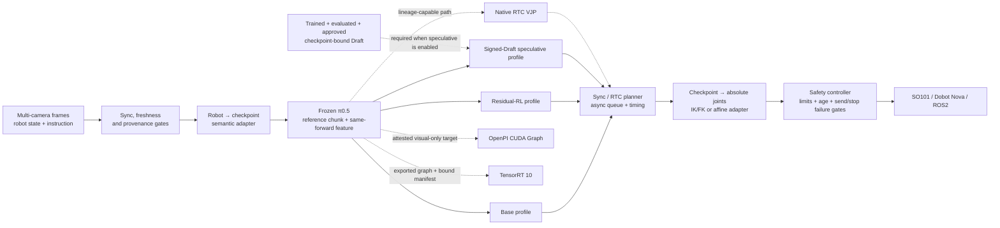

# Fibocom π0.5 VLA Stack

[English](README.md) | [简体中文](README_ZH.md)

**Frozen-base residual RL post-training · auditable VLA inference acceleration · fail-closed robot-integration runtime**

This project extends [RLinf `release/v0.2`](https://github.com/RLinf/RLinf/tree/release/v0.2)
to study two practical bottlenecks in embodied foundation models:

1. how to improve a pretrained **π0.5** policy with a small amount of
   self-collected experience while leaving its base weights frozen; and
2. how to turn continuous-action VLA inference into a measurable, asynchronous,
   hardware-integration runtime with explicit safety gates.

> **Validation status: `component-verified` (2026-08-26).** The branch now
> carries a fixed-revision, SHA-256 manifest for the public RLinf π0.5 RoboTwin
> checkpoint and source-locked contracts for the published Dexmal Draft heads.
> The sealed implementation baseline collected 322 focused tests: **317 passed,
> 5 skipped, 2 warnings** locally, while the remote Linux gate reported
> **321 passed, 1 skipped**. The pinned main-checkpoint H=50 smoke passed one
> seeded synthetic observation with an exact main-backbone load and an explicitly
> classified auxiliary training value head. The manifests, loaders, shape/semantic gates,
> Mock loop, and isolated CUDA components are testable; this is **not** evidence
> that the résumé success-rate
> or end-to-end latency claims have been reproduced on a simulator or physical
> robot. Reported targets and locally observed measurements remain separated
> below.

## At a glance

| Workstream | What this branch provides | Current gate |
|---|---|---|
| **Residual RL post-training** | frozen π0.5 boundary, 1.82M-class bounded residual actor, independent value head, twin-Q auxiliary critic, trajectory GAE, single-epoch PPO, rollout lineage | implemented + unit-tested |
| **CUDA Graph / TensorRT diagnostics** | factory-wired, fail-closed PaliGemma vision-tower/projector capture; TensorRT 10 build manifest, engine builder/runtime, parity, layer-diff and BF16/ULP diagnostics | contracts implemented + unit-tested; no checkpoint-bound π0.5 graph/engine benchmark |
| **Continuous speculative inference** | source-locked Draft loader, 7D→32D warm-start derivation, hash-complete teacher-cache/train/verify/candidate pipeline, signed production gate, OpenPI prefix/KV preparation, one-call B×K verifier, Triton/Torch post-processing | components implemented + unit-tested; no trained/evaluated/signed production π0.5 Draft artifact is shipped |
| **RTC asynchronous inference** | execution/compute overlap, hard prefix, overlap VJP guidance, exponentially decayed weights, separated timing clocks | synthetic CUDA component verified; OpenPI/robot validation pending |
| **Robot integration** | SO101, Dobot Nova TCP, generic ROS2 joint control, OpenCV/RealSense/ROS2 cameras, plus a strict dual-Aloha H50×14 to SO101-6D/Nova-7D retargeting boundary | adapters and locked templates verified; task-specific engine, calibration, and physical validation remain pending |

## Architecture



Solid edges describe the intended logical interfaces. The published main-weight
identity under RLinf's registered H=50 runtime and preprocessing contract is
now pinned, but a successful manifest
check is not a model-forward or robot result. SO101/Nova still require reviewed
state/action conversion, calibration, FK/IK, SDK endpoints, and physical
validation. Dashed edges are optional acceleration paths with explicit
capability gates. In particular, residual/speculative wrappers and a custom
nonlinear FK/IK boundary do not automatically preserve native RTC lineage; the
runtime uses a labelled host output-space fallback rather than presenting
post-processing as denoising-time VJP.

The residual and speculative profiles are deliberately **mutually exclusive**.
An evaluated Draft and verifier are signed against the exact frozen main-policy
contract; that approval cannot authorize actions modified by a residual actor.

## 1. Frozen π0.5 + residual RL post-training

The base policy supplies a reference action chunk and a 2048-D feature from the
same frozen forward pass. A lightweight actor learns only a feasible local
correction:

```text
a_exec[t] = a_ref[t] + δθ(frozen_feature, a_ref)[t]
```

- **Base-weight immutability:** π0.5 is forced to `eval()`, all base parameters
  have `requires_grad=False`, and training rejects accidental unfreezing. This
  protects the weights, but cross-task base-capability retention has not yet
  been evaluated.
- **RL Token-style mapping:** the motivating idea is realized here as
  frozen-prefix, reference-anchored residual post-training; this branch does not
  claim integration of a separate upstream `RLTTokenTransformer` checkpoint.
- **1.82M-class actor:** the source-locked RoboTwin H=50, A=14, hidden-447
  dry-run configuration has exactly **1,819,897 trainable actor parameters**.
  The earlier H=50, A=7, hidden-562 configuration has 1,818,542. Twin-Q and the
  independent state-value head are separate and are not hidden inside either
  count.
- **Reference-anchored action:** asymmetric residual bounds account for both
  `max_residual` and the final action domain, preventing silent post-hoc clipping
  from changing the behavior-policy likelihood.
- **Clean PPO provenance:** every action carries `action_source` and
  `policy_mask`. Reference, guard, clamp, rescue, deterministic, and padding
  actions can train critics where valid but never contaminate PPO log-probability
  ratios.
- **Binary task outcomes + terminal-failure transform:** task inputs are
  chunk-level `{0,1}`. The second discrete failure is rewritten to a configurable
  terminal penalty (default `-1`), then the later tail is zeroed/masked so GAE
  receives a negative terminal outcome. A zero-value-baseline unit test verifies
  backward-negative propagation; with a learned `V(s)`, the implementation does
  not hard-force the advantage sign. The transformed training reward is not
  purely binary, and this code does not prove the reward semantics of the
  historical 112-episode artifacts.
- **Hybrid objective with honest semantics:** an independent `V(s)` supplies
  GAE; twin-Q is an explicitly weighted auxiliary TD/actor objective. The code
  does not substitute `min Q(s,a)` for a state value. `ppo_epochs` is fixed to
  one for the declared single-round update.
- **Auditable residual lineage:** checkpoints record the config hash, residual
  checkpoint SHA-256, and an operator-supplied immutable base-model identity.
  Rollout archives must match the exact residual behavior-checkpoint hash before
  an update can run. The CLI does not independently load or hash π0.5 bytes.

## 2. Inference runtime: profiling, CUDA Graph, and TensorRT

### Shape-stable CUDA Graph

`ShapeStableCUDAGraph` captures only a declared tensor-tree signature. Any
change in structure, shape, stride, dtype, device, or non-tensor input uses the
eager path. Exactness is checked with `torch.equal`, alongside absolute and
relative error diagnostics. This expresses the intended split between a stable
captured subgraph and dynamic eager branches without pretending that the whole
VLA is static.

`OpenPIVisualGraphExecutor` adds the model-facing boundary. The concrete
`RLinfOpenPIVisualGraphAdapter` pins RLinf's PaliGemma layout and reversibly
patches only `embed_image`, covering the vision tower and multimodal projector.
Each new eligible static tensor signature first returns eager output, captures
and checks a separate bounded-cache entry, then replays only after bit-exact
parity. Tokenization, language-model work, dynamic control flow, RTC/VJP,
autograd, training mode, or non-tensor inputs stay eager; a failing signature is
disabled for the executor lifetime. Factory enablement is explicit through
`FIBOCOM_PI05_CUDA_GRAPH_VISUAL=true`. The included benchmark remains a
**synthetic MLP component smoke**: no checkpoint-bound 48.2→42.8 ms measurement
is implied.

### TensorRT evidence path

The TensorRT path now supplies two distinct layers:

- `tensorrt_audit.py`: paired timing, PyTorch/engine structural and numerical
  parity, per-layer first-divergence, and BF16/ULP diagnostics; and
- `tensorrt_build.py`: a strict source-checkpoint/build-input/engine manifest,
  optimization-profile and hardware checks, a TensorRT 10 builder, and an
  `execute_async_v3` runtime for contiguous CUDA tensors.

It deliberately does **not** invent a π0.5 export graph. A caller must provide
an exported ONNX file or a reviewed TensorRT network-populator callback. No
π0.5 engine has been built by this branch, and neither the reported 1.5× speedup
nor a BF16 fusion/rounding root cause is established without checkpoint-bound
engine and layer evidence.

## 3. Continuous-action speculative inference

Token speculation is adapted to an action chunk rather than discrete tokens:

1. a draft policy proposes a complete continuous chunk in one forward pass;
2. the main policy evaluates candidate points along the draft-to-main
   interpolation path through a batched **B×K parallel verifier**;
3. only the longest contiguous compliant prefix is accepted; and
4. the rejected suffix is stitched from the verifier's mean across the `K`
   main-model clean-action candidates.

When acceptance collapses, this branch's configurable override performs a
**same-round full-main takeover**. Metrics label this as a deliberate override
because the audited `realtime-vla-flash` implementation schedules its fallback
for the following round.

The implementation now includes:

- `DraftChunkHead` plus a strict loader for the four published
  `Dexmal/RealtimeVLA-Flash` heads. It re-verifies SHA-256 immediately before
  restricted deserialization and checks metadata, exact state-dict keys,
  shapes, dtypes, and the 110,288,903-parameter geometry;
- `PrefixBundle` and `OpenPIParallelVerifier`, which keep normalized 32-D
  OpenPI model space explicit, run encoder/VLM prefill once, expand the state,
  masks, and KV cache from B to B×K, and make one target velocity call; and
- a full Torch numerical reference. The optional Triton kernel accelerates only
  interpolation, clean-action reconstruction, and per-step absolute/relative
  RMS. Compliance/prefix reduction, verifier averaging, gripper guards, and
  draft/main stitching remain in Torch. Unavailable or failed Triton execution
  reports an explicit fallback reason.

These pieces fail closed on checkpoint, config, normalization, transform,
camera, family, horizon, or action-index mismatch. The published Draft weights
target **π0 LIBERO H=50** (7-D environment actions); they are not a π0.5
production draft. For the pinned π0.5 RoboTwin target, the only authorized use
is explicit **initialization-only warm-start followed by retraining and new
validation**. `pi05_draft.py` creates a new 32-D action head, records training
lineage, exports a non-production candidate, binds an evaluation report, and
requires an Ed25519 approval before its strict production loader can issue a
verified prediction. The public 7-D bytes never gain production authority by
conversion, and this repository ships no trained/evaluated/signed π0.5 Draft.

### Draft training and promotion lineage

`rlinf.projects.fibocom_vla.draft_train_cli` closes the implementation gap
between warm-start and an auditable candidate through five bounded stages:

```text
materialize → verify-cache → train → verify-run → export-candidate
```

- `materialize` owns the exact verified OpenPI teacher during cache generation;
  an external source adapter may supply raw observations, but precomputed
  teacher actions cannot be substituted as labels;
- cache manifests bind source bytes, split indices, target contract, teacher
  identity, per-file SHA-256, sample order, and train/validation separation;
- training binds a clean Git revision, full hyperparameters, optimizer/RNG
  state, checkpoint hashes and resumable step lineage;
- export recomputes held-out metrics from the verified run and writes an
  immutable candidate whose `production_authorized` field remains `false`.

The CLI has no signing operation. A separate review must produce the evaluation
report and Ed25519 approval consumed by the strict production loader. This code
path being complete does not mean that a production π0.5 Draft has been trained
or approved in this repository.

## 4. RTC asynchronous inference

The planner generates the next action chunk while the current chunk executes,
so the action-execution window can overlap model compute. The implementation
preserves the distinction between:

- model compute time;
- planner queue wait;
- caller blocking while waiting for a planner result (legacy metric key
  `robot_wait_ms`), not physical robot/SDK execution time; and
- end-to-end control-loop time.

Native OpenPI RTC carries normalized `ActionChunk.model_values` from the exact
forward that produced the environment action. On the next request it:

- **hard-freezes the already inferred prefix** before and after every denoising
  update;
- aligns the overlap against the previous chunk in model space;
- applies differentiable/VJP guidance with position weights that decay
  exponentially; and
- fails closed when lineage, geometry, or capability declarations disagree.

Output blending is available only as an explicitly named host fallback; it is
not reported as native RTC. Planner shutdown also fails loudly when an in-flight
GPU/model forward cannot be safely joined—Python thread cancellation is not
treated as accelerator cleanup.

## Policy–robot semantics and hardware safety

`PolicyRobotAdapterPolicy` converts robot observations into checkpoint space
before inference and converts policy actions into absolute joint targets before
the controller sees them. The built-in affine adapter supports:

| `action_mode` | Policy-space absolute target at step `t` |
|---|---|
| `absolute` | `a[t]` |
| `delta_from_observation` | `q_obs + a[t]` |
| `integrated_delta` | `q_obs + cumsum(a)[t]` |
| `velocity` | `q_obs + period_s * cumsum(a)[t]` |

Permutation, scale/offset calibration, names, units, dimensions, control period,
finite values, joint limits, per-command deltas, and observation provenance are
validated before a target is returned. `end_effector` and
`checkpoint_native` frames require a reviewed custom `module:function` adapter;
the generic adapter refuses to guess them.

### Supported boundaries

- **Pinned RoboTwin checkpoint:** dual-Aloha, 14-D state/action semantics and
  three cameras. This contract is a model-side integration target, not a claim
  that its outputs can be sent directly to either supported physical backend.
- **SO101 / LeRobot:** five arm joints plus gripper. A six-coordinate Cartesian
  delta cannot be relabelled as six motors; the 7-D LIBERO-style checkpoint
  and the 14-D dual-Aloha checkpoint both require task-specific state/action
  conversion, FK/IK where applicable, and gripper calibration.
- **Dobot Nova TCP/IP V4:** six `ServoJ` arm targets in degrees, 30004 feedback,
  optional binary DO gripper with independent DI feedback, controller/collision
  checks, active-low safety-state handling, and safety-skin approach fields.
- **ROS2:** standard `sensor_msgs/JointState` and
  `trajectory_msgs/JointTrajectory`, with acknowledged Trigger or Dobot V4
  stop/emergency-stop services and real-mode endpoint preflight.
- **Cameras:** OpenCV, RealSense, ROS2 `sensor_msgs/Image`, and Mock. Multi-camera
  reads share one global timeout and pass skew, freshness, and robot/camera
  timestamp gates.

### Source-locked RoboTwin-to-single-arm retargeting

The dedicated `RoboTwinPi05H50SingleArmRetargetingAdapter` preserves the model
side as dual-Aloha H=50×14 and delegates only the deployment-specific mapping
to a reviewed engine declared by
`robot.options.robotwin_retargeting_factory=module:function`. The engine must
implement:

```text
encode_policy_state(observation) -> array[14] | RobotState
policy_chunk_to_robot_targets(observation, policy_values, period_s, config)
  -> array[50, 6] for SO101 | array[50, 7] for Nova
```

The adapter checks all three required cameras, state/camera timestamps, source
observation lineage, joint order, H=50/A=14, finite outputs, absolute target
shape, joint limits, and every per-command step. It never clips or reshapes an
engine result. Real motion additionally requires `engine.validated is True` and
an engine `calibration_id` exactly matching the action-adapter contract. Native
RTC is disabled across this generally non-invertible retargeting boundary.

The checked-in
[`robotwin_pi05_h50_so101_6d_retargeting_locked.json`](config/robotwin_pi05_h50_so101_6d_retargeting_locked.json)
and
[`robotwin_pi05_h50_nova_7d_retargeting_locked.json`](config/robotwin_pi05_h50_nova_7d_retargeting_locked.json)
are complete interface templates with intentionally rejected engine/calibration
placeholders—not generic FK/IK implementations or motion-ready configurations.

All real templates start in `dry_run` and retain deliberate placeholder
calibration/SDK values. Real writes require `action_adapter.validated=true`, a
non-placeholder calibration/kinematics/endpoints contract,
`limits_require_hardware_validation=false` after physical limit review,
`robot.dry_run=false`, **and** the CLI `--allow-motion` switch. Dry-run suppresses
target, stop, and emergency writes; changing one Boolean cannot authorize a
robot. Command publication itself has no universal ACK: the code fail-closes on
send/response errors and requires acknowledgement on configured
stop/emergency-stop service paths.

## What the repository currently proves

| Scope | Observed evidence | Defensible claim | Not established |
|---|---|---|---|
| Final focused unit gate | sealed implementation `b75f92b4`: local Windows/Python 3.10 **322 collected, 317 passed, 5 skipped, 2 warnings**; remote Linux **321 passed, 1 skipped** | deterministic contracts and fail-closed paths covered by those tests | policy quality, latency, simulator success, or physical motion |
| Mock runtime | 16 control steps, two chunks, bounded shutdown | observation→policy→controller plumbing | simulator or physical success |
| Actor geometry | RoboTwin dry-run H=50×A=14 actor = **1,819,897** parameters | architecture/count contract | effectiveness of those parameters |
| Main checkpoint smoke | fixed weight revision and manifest; 3,616,757,520 parameters; strict main-backbone load with missing=0 and unresolved unexpected=0; eight full-FP32 RLinf training value-head keys preserved and explicitly classified as ignored auxiliary; seed-17 synthetic observation; environment `[50,14]`, model `[50,32]`, all finite | the source-locked load/transform/H=50 forward plumbing works for that bounded smoke | latency, throughput, simulator success, policy quality, or robot compatibility |
| Draft asset contract | four fixed SHA-256 π0 LIBERO heads; strict loader and explicit compatibility decision | published bytes can be verified and π0.5 direct use is rejected | a trained production π0.5 Draft |
| CUDA Graph | RTX 4080 SUPER synthetic FP16 MLP, bit-exact, 0.150132→0.050680 ms mean (**2.9623×**) | capture utility works for that synthetic protocol | π0.5 48.2→42.8 ms |
| RTC VJP | synthetic CUDA 50×7 chunk; prefix bit-exact, five VJP steps, loss 0.376497→0.364270 | generic hard-prefix/autograd mechanism | OpenPI latency or robot quality |
| TensorRT | CPU fakes + manifest/builder/runtime and parity/layer-diff protocol unit tests | engine lineage/profile/runtime contracts | π0.5 export/engine run, 1.5×, layer ablation, or BF16 root cause |
| Hardware | SDK/API adapters, Mock lifecycle, locked 14D→6D/7D retargeting contracts, fail-closed gates | integration boundary and engine API are prepared | task-specific retargeting engine, calibration, and SO101/Nova/ROS2 physical validation |

The synthetic GPU figures characterize tiny isolated components only. They are
not substitutes for a checkpoint-bound end-to-end benchmark. The remote
artifacts are bound to implementation commit `fb0d04a8`; later changes must
rerun applicable gates before inheriting those measurements.

<details>
<summary><strong>Historical and external numbers: attribution boundary</strong></summary>

The following numbers were supplied as target claims, recovered from historical
work, or reported by upstream projects; they are **not results reproduced by
this branch**:

| Number | Correct attribution / current blocker |
|---|---|
| reported 112 self-rollouts; 75.0%→96.9%; fewer drops | recovered artifacts contain 80+32 historical training episodes from a mixed reference/actor/heuristic closed-loop policy—not pure actor self-rollouts—plus a 128-episode comparison with different seeds/guards/routes in IsaacLab/Franka simulation; no paired SO101/Nova physical evidence |
| CUDA Graph 48.2→42.8 ms, bit-exact | historical StarVLA/Qwen visual-path evidence, not yet π0.5 |
| TensorRT 1.5×; BF16 fusion rounding | diagnostic hypothesis/path; no checkpoint-bound π0.5 engine evidence |
| Speculative 58.0→19.1 ms, 3.04×; average success −0.3 pp | confirmed only as an upstream FLASH-page report; no same-protocol reproduction here |
| 94.1%→93.8%; fallback 58.4%→84.6%; kernel 1.46×; algorithm 1.66× | reported exact values whose recomputable raw evidence is not closed in the audited sources |
| RTC 5.6 s→4 ms; single inference 76→97 ms | reported external values; clock semantics and the raw source package remain unresolved, with no local end-to-end reproduction |

See the [claim-to-evidence boundary](../../../docs/fibocom_vla_evidence/claim_boundary.md)
for the full audit.

</details>

## Quick start: safe component path

Use the official
[RLinf installation guide](https://rlinf.readthedocs.io/en/latest/rst_source/start/installation.html)
to create the Python 3.10/3.11 embodied environment. From the repository root,
install the source-locked OpenPI/RobotWin environment and this checkout with
RLinf's installer:

```bash
bash requirements/install.sh embodied --model openpi --env robotwin --install-rlinf
```

LeRobot, the Dobot V4 SDK, ROS2 packages, and camera drivers are loaded lazily
and should be installed from their official release/distribution when that
backend is selected. They are not silently installed by this example.

Run the no-motion gates:

```bash
python -m rlinf.projects.fibocom_vla.cli validate-config \
  --config examples/embodiment/fibocom_vla/config/mock.json

python -m rlinf.projects.fibocom_vla.cli validate-config \
  --config examples/embodiment/fibocom_vla/config/robotwin_pi05_h50_dry_run.json

python -m rlinf.projects.fibocom_vla.cli validate-config \
  --config examples/embodiment/fibocom_vla/config/robotwin_pi05_h50_so101_6d_retargeting_locked.json

python -m rlinf.projects.fibocom_vla.cli validate-config \
  --config examples/embodiment/fibocom_vla/config/robotwin_pi05_h50_nova_7d_retargeting_locked.json

python -m rlinf.projects.fibocom_vla.cli actor-report \
  --config examples/embodiment/fibocom_vla/config/robotwin_pi05_h50_dry_run.json

python -m rlinf.projects.fibocom_vla.cli mock-smoke \
  --config examples/embodiment/fibocom_vla/config/mock.json \
  --steps 16

python -m pytest -q tests/unit_tests/projects/fibocom_vla
```

For a focused source-lock/acceleration check, run the exact test modules added
for these boundaries:

```bash
python -m pytest -q \
  tests/unit_tests/projects/fibocom_vla/test_assets.py \
  tests/unit_tests/projects/fibocom_vla/test_draft_assets.py \
  tests/unit_tests/projects/fibocom_vla/test_factories.py \
  tests/unit_tests/projects/fibocom_vla/test_openpi_adapter.py \
  tests/unit_tests/projects/fibocom_vla/test_openpi_checkpoint_report.py \
  tests/unit_tests/projects/fibocom_vla/test_draft_head.py \
  tests/unit_tests/projects/fibocom_vla/test_pi05_draft.py \
  tests/unit_tests/projects/fibocom_vla/test_pi05_draft_training.py \
  tests/unit_tests/projects/fibocom_vla/test_openpi_speculative.py \
  tests/unit_tests/projects/fibocom_vla/test_openpi_production_speculative.py \
  tests/unit_tests/projects/fibocom_vla/test_openpi_cuda_graph.py \
  tests/unit_tests/projects/fibocom_vla/test_robotwin_retargeting.py \
  tests/unit_tests/projects/fibocom_vla/test_triton_speculative.py \
  tests/unit_tests/projects/fibocom_vla/test_tensorrt_build.py
```

OpenPI model execution additionally needs the branch's
`requirements/embodied/models/openpi.txt` pins and `rlinf-openpi==0.1.1` as
installed by the RLinf model installer. A passing CPU contract test does not
therefore imply that a CUDA/OpenPI environment is installed.

On a CUDA host, generate a self-describing **synthetic component** artifact:

```bash
PYTHONPATH=. python examples/embodiment/fibocom_vla/benchmark_cuda_graph.py \
  --output artifacts/cuda_graph_component.json \
  --batch-size 8 --width 256 --depth 4 --dtype float16 \
  --capture-warmup 3 --warmup 5 --repetitions 50
```

## Residual-training entry point

Initialize the residual actor/Q/V state and record the base-model identity before
collecting rollouts:

```bash
python -m rlinf.projects.fibocom_vla.rl.train_cli initialize \
  --config examples/embodiment/fibocom_vla/config/so101_realsense.json \
  --output artifacts/residual_init.pt \
  --base-model pi0.5 \
  --base-model-revision YOUR_IMMUTABLE_PI05_CHECKPOINT_ID \
  --seed 17 --device cuda
```

After the collector has written an archive bound to that checkpoint and config,
run the declared single update:

```bash
python -m rlinf.projects.fibocom_vla.rl.train_cli update \
  --config examples/embodiment/fibocom_vla/config/so101_realsense.json \
  --input-checkpoint artifacts/residual_init.pt \
  --rollout artifacts/rollout.npz \
  --output artifacts/residual_updated.pt \
  --device cuda
```

Mismatched config hashes, recorded base-model revisions, residual
behavior-checkpoint hashes, or rollout geometry are rejected before optimization.
`--base-model` and `--base-model-revision` are operator-supplied metadata: the
CLI accepts any non-empty string and does not load/hash π0.5, so replace
`YOUR_IMMUTABLE_PI05_CHECKPOINT_ID` with a real immutable ID. These two commands
operate on residual checkpoints/archives only; they do not connect to the robot
named by the configuration.

## Source-locked model assets

### RLinf π0.5 weights under the registered H=50 RoboTwin runtime

The checked-in manifest selects one exact public artifact rather than inferring
preprocessing from a directory name:

| Field | Source-locked value |
|---|---|
| Checkpoint | `RLinf/RLinf-Pi05-RoboTwin-SFT-adjust_bottle` |
| Hugging Face revision | `fa8df6ed103db0f5549c122f3a17c00ba6426c98` |
| Registered OpenPI config | `pi05_aloha_robotwin` |
| Asset ID / selected stats | `physical-intelligence/robotwin` / `physical-intelligence/robotwin/norm_stats.json` |
| Runtime geometry | registered H=50; raw state/action=14; normalized/padded model state/action=32 |
| Normalization / transform | quantile `q01/q99`; Aloha repack/adapt-to-π joint and gripper conversion; raw state 14→normalized/padded state 32; 12 arm joints delta and two grippers absolute before the model; output selects the 14 environment coordinates, unnormalizes, inverts delta/Aloha transforms, and returns absolute Aloha targets |
| Camera mapping | observations `cam_high`, `cam_left_wrist`, `cam_right_wrist` → model keys `base_0_rgb`, `left_wrist_0_rgb`, `right_wrist_0_rgb` |

The downloaded publisher `config.json` declares `action_horizon=10`. It is
retained and hashed exactly as published; it is **not** silently rewritten.
RLinf constructs these weights through the registered
`pi05_aloha_robotwin` configuration, whose `Pi0Config` runtime and official
adjust-bottle YAML use H=50. The manifest fingerprints the registered config,
the H=50 YAML, and both Aloha transform sources. The factory independently
checks that registered H=50 value, injects the
declared runtime horizon/image count, and rejects any loaded-model mismatch.
The unrelated `assets/fibocom_mobile/norm_stats.json` is state-15/action-17 and
must not be substituted for the selected RoboTwin statistics.

Install the Hugging Face CLI, then download the complete repository at the
fixed revision into an **absolute** directory. The full main manifest declares
17 files, including all three weight shards; a partial download will fail:

```bash
python -m pip install --upgrade huggingface_hub

MAIN_ROOT=/opt/fibocom-assets/RLinf-Pi05-RoboTwin-SFT-adjust_bottle-fa8df6e
hf download RLinf/RLinf-Pi05-RoboTwin-SFT-adjust_bottle \
  --revision fa8df6ed103db0f5549c122f3a17c00ba6426c98 \
  --local-dir "$MAIN_ROOT"

python -m rlinf.projects.fibocom_vla.cli verify-checkpoint-assets \
  --manifest examples/embodiment/fibocom_vla/assets/rlinf_pi05_robotwin_adjust_bottle_h50.json \
  --root "$MAIN_ROOT" \
  --config examples/embodiment/fibocom_vla/config/robotwin_pi05_h50_dry_run.json
```

On Windows, use an absolute drive path such as
`E:\model_assets\fibocom_vla\RLinf-Pi05-RoboTwin-SFT-adjust_bottle-fa8df6e`
for `--root` and `FIBOCOM_PI05_MODEL_PATH`. The command verifies size and
SHA-256 for **every declared file**, validates config/stat dimensions, checks
the source fingerprints for the Aloha data/policy transforms in this checkout,
and finally compares the dry-run stack semantics. A pass authenticates bytes
and contracts; it does not prove that a model forward ran.

The separately sealed `b75f92b4` CUDA/OpenPI smoke did run one seed-17 synthetic
observation through the 3,616,757,520-parameter policy. The main state dict was
exact (`missing_keys=[]`, `unresolved_unexpected_keys=[]`). The raw report also
retained all eight full-FP32 RLinf training value-head keys and classified them
as the known auxiliary
`rlinf_training_value_head_1024_512_256_128_1_f32_v1`, rather than hiding them
or weakening the backbone gate. It produced finite environment `[50,14]` and
model `[50,32]` chunks. This is a load/transform/forward smoke, not a latency or
task-quality benchmark.

### Published Draft assets: π0 only

The original Realtime-VLA FLASH heads are pinned separately:

| Field | Published contract |
|---|---|
| Checkpoint repository / revision | `Dexmal/RealtimeVLA-Flash` / `77b9a6f88fb100230bc78cb4cb361bd2e586f9fb` |
| Audited code revision | `da6ceccad603695a8a3d6fa14dd410c3aadb536f` |
| Target | **π0** `pi0_libero`, H=50, environment A=7, model A=32 |
| Context | 32-D projected state, 2048-D prefix embeddings, max token length 48 |
| Data semantics | z-score `physical-intelligence/libero`, delta transform on the first six actions |

Download and verify only the suite you intend to inspect (the registry pins
`libero_10`, `libero_goal`, `libero_object`, and `libero_spatial`):

```bash
DRAFT_ROOT=/opt/fibocom-assets/Dexmal-RealtimeVLA-Flash-77b9a6f
hf download Dexmal/RealtimeVLA-Flash draft_libero_10.pt \
  --revision 77b9a6f88fb100230bc78cb4cb361bd2e586f9fb \
  --local-dir "$DRAFT_ROOT"

python -m rlinf.projects.fibocom_vla.cli verify-draft-asset \
  --registry examples/embodiment/fibocom_vla/assets/dexmal_flash_pi0_libero_drafts.json \
  --root "$DRAFT_ROOT" \
  --suite libero_10
```

`verify-draft-asset` proves the selected published bytes; it deliberately prints
`pi05_direct_use: false`. Direct production resolution is available only for
the exact π0 LIBERO base contract. Against π0.5 RoboTwin, callers must request
`resolve_warm_start(...)` and load with `purpose="warm_start"`; the resulting
head is initialization-only and cannot create a production prediction adapter.
`derive_pi05_draft_from_warm_start` copies only compatible query/state/decoder
parameters and initializes a fresh 32-D action head. Any derived candidate is
still exported with `production_authorized=false`; it must be retrained against
the exact π0.5 checkpoint/normalization/transform/cameras, evaluated under a
content-bound protocol, and Ed25519-approved before the production loader will
accept it.

### Manifest-bound factory assembly

After the main verification gate passes, bind the same absolute root and
manifest to the default factory. Do not set `FIBOCOM_WRIST_CAMERA` in manifest
mode: the ordered three-camera contract comes from the manifest and cannot be
overridden.

```bash
export FIBOCOM_PI05_MODEL_PATH="$MAIN_ROOT"
export FIBOCOM_PI05_ASSET_MANIFEST="$PWD/examples/embodiment/fibocom_vla/assets/rlinf_pi05_robotwin_adjust_bottle_h50.json"
export FIBOCOM_PI05_CONFIG_NAME=pi05_aloha_robotwin
export FIBOCOM_PI05_DEVICE=cuda
export FIBOCOM_PI05_DENOISE_STEPS=5

# One zero-image/state H=50 forward; this is a smoke, not a latency benchmark.
python -m rlinf.projects.fibocom_vla.cli openpi-checkpoint-smoke \
  --config examples/embodiment/fibocom_vla/config/robotwin_pi05_h50_dry_run.json \
  --seed 17

# Optional visual-only graph route. RTC/speculative contexts still force eager.
export FIBOCOM_PI05_CUDA_GRAPH_VISUAL=true
export FIBOCOM_PI05_CUDA_GRAPH_CACHE_CAPACITY=4
export FIBOCOM_PI05_CUDA_GRAPH_WARMUP=3

# Bounded model/Mock integration; this cannot command a real robot.
python -m rlinf.projects.fibocom_vla.cli run \
  --config examples/embodiment/fibocom_vla/config/robotwin_pi05_h50_dry_run.json \
  --instruction "stack the red block on the blue block" \
  --steps 16
```

Set `FIBOCOM_RESIDUAL_CHECKPOINT` only when `residual_rl.enabled=true`; it must
retain the adjacent `.sha256` sidecar emitted by `train_cli`. Residual and
speculative modes cannot be enabled together.

When `speculative.enabled=true`, the factory constructs the OpenPI verifier
itself and accepts only a manifest-bound main target plus an evaluated,
Ed25519-approved π0.5 Draft. Configure it with:

```bash
export FIBOCOM_PI05_DRAFT_MANIFEST=/absolute/path/to/candidate/manifest.json
export FIBOCOM_PI05_DRAFT_EVALUATION=/absolute/path/to/evaluation.json
export FIBOCOM_PI05_DRAFT_APPROVAL=/absolute/path/to/approval.json
export FIBOCOM_PI05_DRAFT_PUBLIC_KEY=/absolute/path/to/ed25519_public_key.raw
export FIBOCOM_PI05_DRAFT_SIGNING_KEY_ID=reviewed-key-id

# Optional; defaults shown.
export FIBOCOM_PI05_DRAFT_DTYPE=bfloat16
export FIBOCOM_PI05_SPECULATIVE_BACKEND=auto
export FIBOCOM_PI05_SPECULATIVE_EPISODE_ID=factory-episode-0
export FIBOCOM_PI05_SPECULATIVE_VERIFICATION_TIMES=0.10,0.05
```

`FIBOCOM_PI05_DRAFT_PUBLIC_KEY` must be an absolute path to exactly 32 raw
Ed25519 public-key bytes. The public π0 LIBERO Draft cannot satisfy this π0.5
production contract; only a retrained candidate with matching evaluation and
approval artifacts can enter the production policy.

The checked-in real-robot templates remain motion-blocked by explicit
validation, calibration, kinematics, endpoint, and limit gates. Camera/topic/
SDK placeholder strings may fail during connection preflight or first I/O and
must be reviewed manually. Keep `dry_run=true` for the first read-only
integration.

### Motion authorization checklist

Before any physical write:

1. replace serial/IP/topic/service placeholders and verify feedback freshness;
2. bind the exact checkpoint camera/state/action contract and H=50 manifest;
3. validate joint names, order, units, scale/offset, limits, and control period;
4. replace every calibration/kinematics/endpoint placeholder, set
   `action_adapter.validated=true`, and only after physical limit review set
   `limits_require_hardware_validation=false`;
5. install and review the task-specific retargeting engine, FK/IK, and gripper
   conversion; require `engine.validated=true` and an exact calibration-ID match;
6. verify its 14-D policy-state encoding and H50×6/H50×7 absolute-target output
   against synchronized camera/state observations;
7. complete a read-only dry run, then a separately supervised bounded-motion
   test with `robot.dry_run=false` and `--allow-motion`;
8. for 7-D Dobot control, set
   `gripper_feedback_backend=digital_input` and verify independent DI feedback;
9. verify acknowledged stop/emergency-stop behavior and keep the physical
   emergency stop reachable.

## Repository map

```text
rlinf/projects/fibocom_vla/
├── rl/          residual actor, value/twin-Q, binary-outcome transform, GAE/PPO
├── inference/   Draft head/training lineage, OpenPI/Triton speculative,
│                CUDA Graph, RTC, TensorRT build/runtime/audit
├── hardware/    retargeting/kinematics adapters, SO101, Dobot, ROS2, cameras
├── runtime/     synchronized control, safety gates, timing, lifecycle
├── assets.py    main-checkpoint byte/transform/stack manifest verification
├── draft_assets.py  published Draft byte and compatibility authorization
├── draft_train_cli.py  hash-bound cache/train/verify/candidate workflow
├── factories.py fail-closed π0.5 / residual / speculative stack assembly
└── cli.py       config/assets validation, actor report, Mock smoke, bounded run

examples/embodiment/fibocom_vla/
├── assets/      fixed-revision main and Draft SHA-256 manifests
├── config/      Mock, H50 RoboTwin dry-run, and locked SO101/Nova
│                retargeting templates
├── schema/      action-adapter JSON schema
└── benchmark_cuda_graph.py

docs/fibocom_vla_evidence/
├── claim_boundary.md
├── reproduction_matrix.csv
├── source_lock.json
├── local_validation_20260826.md
├── remote_validation_20260826.md
└── remote_b75f92b4/openpi_checkpoint_smoke_b75f92b4.json
```

## Evidence and audited sources

- [Claim boundary](../../../docs/fibocom_vla_evidence/claim_boundary.md)
- [Reproduction matrix](../../../docs/fibocom_vla_evidence/reproduction_matrix.csv)
- [Current local validation record](../../../docs/fibocom_vla_evidence/local_validation_20260826.md)
- [Current remote validation record](../../../docs/fibocom_vla_evidence/remote_validation_20260826.md)
- [Sealed main-checkpoint smoke JSON](../../../docs/fibocom_vla_evidence/remote_b75f92b4/openpi_checkpoint_smoke_b75f92b4.json)
- [Pinned source identities](../../../docs/fibocom_vla_evidence/source_lock.json)

| Source | Audited revision | Role |
|---|---|---|
| [RLinf](https://github.com/RLinf/RLinf) | `release/v0.2` / `46213e88` | implementation base; OpenPI and RL conventions |
| RLinf main | `12881eda` | backported π0.5 RoboTwin config/transforms and OpenPI dependency pins |
| [RLinf π0.5 RoboTwin weights](https://huggingface.co/RLinf/RLinf-Pi05-RoboTwin-SFT-adjust_bottle) | `fa8df6ed` | source-locked weights used only under the separately attested registered H=50 runtime; publisher metadata itself says H=10 |
| [FlashRT](https://github.com/flashrt-project/FlashRT) | `f72192b2` | capture/exactness and runtime design audit |
| [realtime-vla-flash](https://github.com/dexmal/realtime-vla-flash) | `da6cecca` | continuous draft, verification, prefix and RTC audit |
| [RealtimeVLA-Flash Draft weights](https://huggingface.co/Dexmal/RealtimeVLA-Flash) | `77b9a6f8` | production only for the exact π0 LIBERO contract; warm-start-only for π0.5 |
| [LeRobot](https://github.com/huggingface/lerobot) | `v0.4.4` / `8fff0fde` | SO101 API contract |
| [Dobot TCP/IP V4](https://github.com/Dobot-Arm/TCP-IP-Python-V4) | `55ec1ec8` | Nova direct-control contract |
| [Dobot ROS2 V4](https://github.com/Dobot-Arm/DOBOT_6Axis_ROS2_V4) | `def21d05` | ROS2 stop/emergency contract |

## Remaining integration milestones

- run paired AB/BA checkpoint-bound capture latency/equivalence benchmarks for
  the implemented visual adapter;
- export the exact π0.5 graph, build a manifest-bound TensorRT engine, and run
  parity/layer attribution before selecting it at runtime;
- retrain and validate a checkpoint-bound π0.5 Draft; never promote the
  published π0 warm-start weights directly;
- run paired same-reset/seed simulator evaluation before quoting success rates;
- finish read-only, bounded-motion, and task-level validation on SO101/Nova.

The branch code follows the parent repository's
[Apache-2.0 license](../../../LICENSE). Third-party checkpoints remain governed
by their own repositories; in particular, the pinned main checkpoint repository
does not declare a weight license in its metadata, so this repository does not
relicense those bytes. The core rule is simple: **a code path, an upstream
number, and a reproduced result are three different things**—each must retain
its own provenance.
