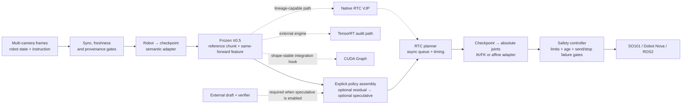

# Fibocom π0.5 VLA Stack

[English](README.md) | [简体中文](README_ZH.md)

**Frozen-base residual RL post-training · auditable VLA inference acceleration · fail-closed robot-integration runtime**

This project extends [RLinf `release/v0.2`](https://github.com/RLinf/RLinf/tree/release/v0.2)
to study two practical bottlenecks in embodied foundation models:

1. how to improve a pretrained **π0.5** policy with a small amount of
   self-collected experience while leaving its base weights frozen; and
2. how to turn continuous-action VLA inference into a measurable, asynchronous,
   hardware-integration runtime with explicit safety gates.

> **Validation status: `component-verified` (2026-08-25).** The repository has
> passed 131 focused unit tests, a 16-step Mock control loop, and bounded
> synthetic CUDA Graph/RTC GPU smokes. It has **not** yet reproduced the reported
> success rates or end-to-end π0.5 latency on a simulator or physical robot.
> Every reported, upstream, historical, and newly measured number is labelled
> separately below.

## At a glance

| Workstream | What this branch provides | Current gate |
|---|---|---|
| **Residual RL post-training** | frozen π0.5 boundary, 1.82M-class bounded residual actor, independent value head, twin-Q auxiliary critic, trajectory GAE, single-epoch PPO, rollout lineage | implemented + unit-tested |
| **CUDA Graph / TensorRT diagnostics** | shape-stable graph capture with eager fallback and strict exactness; TensorRT paired timing, parity, layer-diff and BF16/ULP diagnostics | CUDA Graph synthetic GPU component-verified; TensorRT audit contracts unit-tested with CPU fakes |
| **Continuous speculative inference** | chunk draft, batched interpolation-path verification, contiguous-prefix acceptance, explicit low-acceptance takeover | implemented + unit-tested; checkpoint-specific draft/verifier pending |
| **RTC asynchronous inference** | execution/compute overlap, hard prefix, overlap VJP guidance, exponentially decayed weights, separated timing clocks | synthetic CUDA component verified; OpenPI/robot validation pending |
| **Robot integration** | SO101, Dobot Nova TCP, generic ROS2 joint control, OpenCV/RealSense/ROS2 cameras, semantic adapters and fail-closed safety gates | Mock verified; real hardware placeholders remain locked |

## Architecture



Solid edges describe the intended logical interfaces; only the Mock path has
been executed. Real π0.5 and robot endpoints remain blocked on the H=50 model,
kinematics, calibration, and SDK values. Dashed edges are optional acceleration
paths with explicit capability gates. In particular, the current residual
wrapper, speculative wrapper, and custom nonlinear IK/FK boundary do not
preserve a provably native RTC lineage end to end; they therefore select a
labelled host output-space fallback instead of claiming denoising-time VJP.

## 1. Frozen π0.5 + residual RL post-training

The base policy supplies a reference action chunk and a 2048-D feature from the
same frozen forward pass. A lightweight actor learns only a feasible local
correction:

```text
a_exec[t] = a_ref[t] + δθ(frozen_feature, a_ref)[t]
```

- **Base-weight immutability:** π0.5 is forced to `eval()`, all base parameters
  have `requires_grad=False`, and training rejects accidental unfreezing. This
  protects the weights, but cross-task base-capability retention has not yet
  been evaluated.
- **RL Token-style mapping:** the motivating idea is realized here as
  frozen-prefix, reference-anchored residual post-training; this branch does not
  claim integration of a separate upstream `RLTTokenTransformer` checkpoint.
- **1.82M-class actor:** the 50×7, hidden-562 configuration has exactly
  **1,818,542 trainable actor parameters**. The 50×6, hidden-581 configuration
  has 1,819,139. Twin-Q and the independent state-value head are separate and
  are not hidden inside this count.
- **Reference-anchored action:** asymmetric residual bounds account for both
  `max_residual` and the final action domain, preventing silent post-hoc clipping
  from changing the behavior-policy likelihood.
- **Clean PPO provenance:** every action carries `action_source` and
  `policy_mask`. Reference, guard, clamp, rescue, deterministic, and padding
  actions can train critics where valid but never contaminate PPO log-probability
  ratios.
- **Binary task outcomes + terminal-failure transform:** task inputs are
  chunk-level `{0,1}`. The second discrete failure is rewritten to a configurable
  terminal penalty (default `-1`), then the later tail is zeroed/masked so GAE
  receives a negative terminal outcome. A zero-value-baseline unit test verifies
  backward-negative propagation; with a learned `V(s)`, the implementation does
  not hard-force the advantage sign. The transformed training reward is not
  purely binary, and this code does not prove the reward semantics of the
  historical 112-episode artifacts.
- **Hybrid objective with honest semantics:** an independent `V(s)` supplies
  GAE; twin-Q is an explicitly weighted auxiliary TD/actor objective. The code
  does not substitute `min Q(s,a)` for a state value. `ppo_epochs` is fixed to
  one for the declared single-round update.
- **Auditable residual lineage:** checkpoints record the config hash, residual
  checkpoint SHA-256, and an operator-supplied immutable base-model identity.
  Rollout archives must match the exact residual behavior-checkpoint hash before
  an update can run. The CLI does not independently load or hash π0.5 bytes.

## 2. Inference runtime: profiling, CUDA Graph, and TensorRT

### Shape-stable CUDA Graph

`ShapeStableCUDAGraph` captures only a declared tensor-tree signature. Any
change in structure, shape, stride, dtype, device, or non-tensor input uses the
eager path. Exactness is checked with `torch.equal`, alongside absolute and
relative error diagnostics. This expresses the intended split between a stable
captured subgraph and dynamic eager branches without pretending that the whole
VLA is static.

The included benchmark is deliberately a **synthetic MLP component smoke**.
The production OpenPI visual/language subgraph has not yet been wired to this
capture utility.

### TensorRT evidence path

The TensorRT module supplies a dependency-lazy engine runner, paired timing,
PyTorch-versus-engine structural/numerical parity, per-layer comparison and
first-divergence diagnostics, and BF16/ULP-style diagnostics. A BF16 fusion or
rounding explanation requires an external evidence marker; this branch has not
executed a layer-by-layer TensorRT engine ablation.

This repository does **not** yet contain a π0.5 exporter, engine builder, or a
verified 1.5× deployment result.

## 3. Continuous-action speculative inference

Token speculation is adapted to an action chunk rather than discrete tokens:

1. a draft policy proposes a complete continuous chunk in one forward pass;
2. the main policy evaluates candidate points along the draft-to-main
   interpolation path through a batched **B×K parallel verifier**;
3. only the longest contiguous compliant prefix is accepted; and
4. the rejected suffix is stitched from the verifier's mean across the `K`
   main-model clean-action candidates.

When acceptance collapses, this branch's configurable override performs a
**same-round full-main takeover**. Metrics label this as a deliberate override
because the audited `realtime-vla-flash` implementation schedules its fallback
for the following round.

The orchestration, prefix contract, gripper capability guard, and fallback are
implemented and tested. A checkpoint-bound π0.5 draft, normalized model-space
parallel verifier, and production Triton kernel are **not checked in**;
production assembly therefore requires external factories rather than silently
using a mock policy.

## 4. RTC asynchronous inference

The planner generates the next action chunk while the current chunk executes,
so the action-execution window can overlap model compute. The implementation
preserves the distinction between:

- model compute time;
- planner queue wait;
- caller blocking while waiting for a planner result (legacy metric key
  `robot_wait_ms`), not physical robot/SDK execution time; and
- end-to-end control-loop time.

Native OpenPI RTC carries normalized `ActionChunk.model_values` from the exact
forward that produced the environment action. On the next request it:

- **hard-freezes the already inferred prefix** before and after every denoising
  update;
- aligns the overlap against the previous chunk in model space;
- applies differentiable/VJP guidance with position weights that decay
  exponentially; and
- fails closed when lineage, geometry, or capability declarations disagree.

Output blending is available only as an explicitly named host fallback; it is
not reported as native RTC. Planner shutdown also fails loudly when an in-flight
GPU/model forward cannot be safely joined—Python thread cancellation is not
treated as accelerator cleanup.

## Policy–robot semantics and hardware safety

`PolicyRobotAdapterPolicy` converts robot observations into checkpoint space
before inference and converts policy actions into absolute joint targets before
the controller sees them. The built-in affine adapter supports:

| `action_mode` | Policy-space absolute target at step `t` |
|---|---|
| `absolute` | `a[t]` |
| `delta_from_observation` | `q_obs + a[t]` |
| `integrated_delta` | `q_obs + cumsum(a)[t]` |
| `velocity` | `q_obs + period_s * cumsum(a)[t]` |

Permutation, scale/offset calibration, names, units, dimensions, control period,
finite values, joint limits, per-command deltas, and observation provenance are
validated before a target is returned. `end_effector` and
`checkpoint_native` frames require a reviewed custom `module:function` adapter;
the generic adapter refuses to guess them.

### Supported boundaries

- **SO101 / LeRobot:** five arm joints plus gripper. A six-coordinate Cartesian
  delta cannot be relabelled as six motors; the 7-D LIBERO-style checkpoint
  requires task-specific FK/IK and gripper conversion.
- **Dobot Nova TCP/IP V4:** six `ServoJ` arm targets in degrees, 30004 feedback,
  optional binary DO gripper with independent DI feedback, controller/collision
  checks, active-low safety-state handling, and safety-skin approach fields.
- **ROS2:** standard `sensor_msgs/JointState` and
  `trajectory_msgs/JointTrajectory`, with acknowledged Trigger or Dobot V4
  stop/emergency-stop services and real-mode endpoint preflight.
- **Cameras:** OpenCV, RealSense, ROS2 `sensor_msgs/Image`, and Mock. Multi-camera
  reads share one global timeout and pass skew, freshness, and robot/camera
  timestamp gates.

All real templates start in `dry_run` and retain deliberate placeholder
calibration/SDK values. Real writes require `action_adapter.validated=true`, a
non-placeholder calibration/kinematics/endpoints contract,
`limits_require_hardware_validation=false` after physical limit review,
`robot.dry_run=false`, **and** the CLI `--allow-motion` switch. Dry-run suppresses
target, stop, and emergency writes; changing one Boolean cannot authorize a
robot. Command publication itself has no universal ACK: the code fail-closes on
send/response errors and requires acknowledgement on configured
stop/emergency-stop service paths.

## What the repository currently proves

| Scope | Observed evidence | Defensible claim | Not established |
|---|---|---|---|
| CPU/unit | **131 passed** on local Windows/Python 3.10 and remote Linux; Ruff/format/compile gates pass | deterministic component contracts and error paths | policy quality or latency |
| Mock runtime | 16 control steps, two chunks, bounded shutdown | observation→policy→controller plumbing | simulator or physical success |
| Actor geometry | H=50×A=7 actor = **1,818,542** parameters | architecture/count contract | effectiveness of those parameters |
| CUDA Graph | RTX 4080 SUPER synthetic FP16 MLP, bit-exact, 0.150132→0.050680 ms mean (**2.9623×**) | capture utility works for that synthetic protocol | π0.5 48.2→42.8 ms |
| RTC VJP | synthetic CUDA 50×7 chunk; prefix bit-exact, five VJP steps, loss 0.376497→0.364270 | generic hard-prefix/autograd mechanism | OpenPI latency or robot quality |
| TensorRT | CPU fakes + parity/layer-diff protocol unit tests | audit contracts | π0.5 engine run/export, 1.5×, layer ablation, or BF16 root cause |
| Hardware | SDK/API adapters, Mock lifecycle, fail-closed gates | integration boundary is prepared | SO101/Nova/ROS2 physical validation |

The synthetic GPU figures characterize tiny isolated components only. They are
not substitutes for a checkpoint-bound end-to-end benchmark. The remote
artifacts are bound to implementation commit `fb0d04a8`; later changes must
rerun applicable gates before inheriting those measurements.

<details>
<summary><strong>Historical and external numbers: attribution boundary</strong></summary>

The following numbers were supplied as target claims, recovered from historical
work, or reported by upstream projects; they are **not results reproduced by
this branch**:

| Number | Correct attribution / current blocker |
|---|---|
| reported 112 self-rollouts; 75.0%→96.9%; fewer drops | recovered artifacts contain 80+32 historical training episodes from a mixed reference/actor/heuristic closed-loop policy—not pure actor self-rollouts—plus a 128-episode comparison with different seeds/guards/routes in IsaacLab/Franka simulation; no paired SO101/Nova physical evidence |
| CUDA Graph 48.2→42.8 ms, bit-exact | historical StarVLA/Qwen visual-path evidence, not yet π0.5 |
| TensorRT 1.5×; BF16 fusion rounding | diagnostic hypothesis/path; no checkpoint-bound π0.5 engine evidence |
| Speculative 58.0→19.1 ms, 3.04×; average success −0.3 pp | confirmed only as an upstream FLASH-page report; no same-protocol reproduction here |
| 94.1%→93.8%; fallback 58.4%→84.6%; kernel 1.46×; algorithm 1.66× | reported exact values whose recomputable raw evidence is not closed in the audited sources |
| RTC 5.6 s→4 ms; single inference 76→97 ms | reported external values; clock semantics and the raw source package remain unresolved, with no local end-to-end reproduction |

See the [claim-to-evidence boundary](../../../docs/fibocom_vla_evidence/claim_boundary.md)
for the full audit.

</details>

## Quick start: safe component path

Use the official
[RLinf installation guide](https://rlinf.readthedocs.io/en/latest/rst_source/start/installation.html)
to create the Python 3.10/3.11 embodied environment. From the repository root,
install this checkout and only the SDK dependencies needed by the selected
hardware backend:

```bash
python -m pip install -e ".[embodied]"
```

LeRobot, the Dobot V4 SDK, ROS2 packages, and camera drivers are loaded lazily
and should be installed from their official release/distribution when that
backend is selected. They are not silently installed by this example.

Run the no-motion gates:

```bash
python -m rlinf.projects.fibocom_vla.cli validate-config \
  --config examples/embodiment/fibocom_vla/config/mock.json

python -m rlinf.projects.fibocom_vla.cli actor-report \
  --config examples/embodiment/fibocom_vla/config/mock.json

python -m rlinf.projects.fibocom_vla.cli mock-smoke \
  --config examples/embodiment/fibocom_vla/config/mock.json \
  --steps 16

python -m pytest -q tests/unit_tests/projects/fibocom_vla
```

On a CUDA host, generate a self-describing **synthetic component** artifact:

```bash
PYTHONPATH=. python examples/embodiment/fibocom_vla/benchmark_cuda_graph.py \
  --output artifacts/cuda_graph_component.json \
  --batch-size 8 --width 256 --depth 4 --dtype float16 \
  --capture-warmup 3 --warmup 5 --repetitions 50
```

## Residual-training entry point

Initialize the residual actor/Q/V state and record the base-model identity before
collecting rollouts:

```bash
python -m rlinf.projects.fibocom_vla.rl.train_cli initialize \
  --config examples/embodiment/fibocom_vla/config/so101_realsense.json \
  --output artifacts/residual_init.pt \
  --base-model pi0.5 \
  --base-model-revision YOUR_IMMUTABLE_PI05_CHECKPOINT_ID \
  --seed 17 --device cuda
```

After the collector has written an archive bound to that checkpoint and config,
run the declared single update:

```bash
python -m rlinf.projects.fibocom_vla.rl.train_cli update \
  --config examples/embodiment/fibocom_vla/config/so101_realsense.json \
  --input-checkpoint artifacts/residual_init.pt \
  --rollout artifacts/rollout.npz \
  --output artifacts/residual_updated.pt \
  --device cuda
```

Mismatched config hashes, recorded base-model revisions, residual
behavior-checkpoint hashes, or rollout geometry are rejected before optimization.
`--base-model` and `--base-model-revision` are operator-supplied metadata: the
CLI accepts any non-empty string and does not load/hash π0.5, so replace
`YOUR_IMMUTABLE_PI05_CHECKPOINT_ID` with a real immutable ID. These two commands
operate on residual checkpoints/archives only; they do not connect to the robot
named by the configuration.

## Connect your π0.5 assets

Model and checkpoint-specific preprocessing are never guessed. The loaded
OpenPI model's `action_horizon` must equal the stack horizon. RLinf v0.2's stock
`pi05_libero` configuration is H=10, while the checked-in residual examples are
H=50; `action_chunk` can truncate but cannot extend a checkpoint. Register a
real H=50 data/model config instead of overriding metadata.

```bash
export FIBOCOM_PI05_MODEL_PATH=/absolute/path/to/pi05/checkpoint
export FIBOCOM_PI05_CONFIG_NAME=your_registered_pi05_h50_config
export FIBOCOM_PI05_DEVICE=cuda
export FIBOCOM_MAIN_CAMERA=main
export FIBOCOM_WRIST_CAMERA=wrist
export FIBOCOM_RESIDUAL_CHECKPOINT=artifacts/residual_updated.pt

# Required only when speculative.enabled=true:
export FIBOCOM_DRAFT_POLICY_FACTORY=your_package.factories:create_draft
export FIBOCOM_PARALLEL_VERIFIER_FACTORY=your_package.factories:create_verifier

python -m rlinf.projects.fibocom_vla.cli run \
  --config examples/embodiment/fibocom_vla/config/so101_realsense.json \
  --instruction "stack the red block on the blue block" \
  --steps 32
```

`FIBOCOM_RESIDUAL_CHECKPOINT` must retain the adjacent
`artifacts/residual_updated.pt.sha256` sidecar emitted by `train_cli`; loading
fails closed without it. The checked-in real-robot templates remain
motion-blocked by the explicit validation, calibration, kinematics, and limit
gates. Camera/topic/SDK placeholder strings are not globally pattern-checked;
depending on the backend they may fail during connection preflight or first I/O
and must be reviewed manually. Keep `dry_run=true` for the first read-only
integration.

### Motion authorization checklist

Before any physical write:

1. replace serial/IP/topic/service placeholders and verify feedback freshness;
2. bind the exact checkpoint camera/state/action contract and H=50 manifest;
3. validate joint names, order, units, scale/offset, limits, and control period;
4. replace every calibration/kinematics/endpoint placeholder, set
   `action_adapter.validated=true`, and only after physical limit review set
   `limits_require_hardware_validation=false`;
5. install and review task-specific FK/IK and gripper conversion where required;
6. complete a read-only dry run, then a separately supervised bounded-motion
   test with `robot.dry_run=false` and `--allow-motion`;
7. for 7-D Dobot control, set
   `gripper_feedback_backend=digital_input` and verify independent DI feedback;
8. verify acknowledged stop/emergency-stop behavior and keep the physical
   emergency stop reachable.

## Repository map

```text
rlinf/projects/fibocom_vla/
├── rl/          residual actor, value/twin-Q, binary-outcome transform, GAE/PPO
├── inference/   profiling, CUDA Graph, speculative, RTC, TensorRT diagnostics
├── hardware/    semantic/kinematics adapters, SO101, Dobot, ROS2, cameras
├── runtime/     synchronized control, safety gates, timing, lifecycle
├── factories.py fail-closed π0.5 / residual / speculative stack assembly
└── cli.py       config validation, actor report, Mock smoke, bounded run

examples/embodiment/fibocom_vla/
├── config/      Mock and locked real-robot templates
├── schema/      action-adapter JSON schema
└── benchmark_cuda_graph.py

docs/fibocom_vla_evidence/
├── claim_boundary.md
├── reproduction_matrix.csv
├── source_lock.json
├── local_validation_20260825.md
└── remote_validation_20260825.md
```

## Evidence and audited sources

- [Claim boundary](../../../docs/fibocom_vla_evidence/claim_boundary.md)
- [Reproduction matrix](../../../docs/fibocom_vla_evidence/reproduction_matrix.csv)
- [Local validation record](../../../docs/fibocom_vla_evidence/local_validation_20260825.md)
- [Remote CUDA component record](../../../docs/fibocom_vla_evidence/remote_validation_20260825.md)
- [Pinned source identities](../../../docs/fibocom_vla_evidence/source_lock.json)

| Source | Audited revision | Role |
|---|---|---|
| [RLinf](https://github.com/RLinf/RLinf) | `release/v0.2` / `46213e88` | implementation base; OpenPI and RL conventions |
| RLinf main | `230ea79b` | compatibility comparison only |
| [FlashRT](https://github.com/flashrt-project/FlashRT) | `f72192b2` | capture/exactness and runtime design audit |
| [realtime-vla-flash](https://github.com/dexmal/realtime-vla-flash) | `da6cecca` | continuous draft, verification, prefix and RTC audit |
| [LeRobot](https://github.com/huggingface/lerobot) | `v0.4.4` / `8fff0fde` | SO101 API contract |
| [Dobot TCP/IP V4](https://github.com/Dobot-Arm/TCP-IP-Python-V4) | `55ec1ec8` | Nova direct-control contract |
| [Dobot ROS2 V4](https://github.com/Dobot-Arm/DOBOT_6Axis_ROS2_V4) | `def21d05` | ROS2 stop/emergency contract |

## Remaining integration milestones

- bind and freeze a real π0.5 H=50 checkpoint/config manifest;
- capture a checkpoint-specific OpenPI visual subgraph and run paired AB/BA
  latency/equivalence benchmarks;
- implement π0.5 TensorRT export/build/runtime selection;
- provide a checkpoint-bound draft and normalized model-space verifier;
- run paired same-reset/seed simulator evaluation before quoting success rates;
- finish read-only, bounded-motion, and task-level validation on SO101/Nova.

This project follows the parent repository's [Apache-2.0 license](../../../LICENSE).
Its core rule is simple: **a code path, an upstream number, and a reproduced
result are three different things**—each must retain its own provenance.
