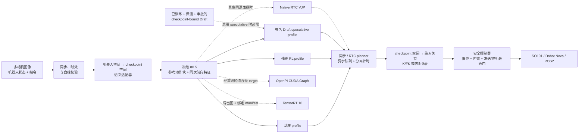

# Fibocom π0.5 VLA Stack

[English](README.md) | [简体中文](README_ZH.md)

**冻结基座的残差 RL 后训练 · 可审计的 VLA 推理加速 · Fail-closed 真机接入运行时**

本项目基于 [RLinf `release/v0.2`](https://github.com/RLinf/RLinf/tree/release/v0.2)，
面向具身基础模型的两个工程瓶颈：

1. 如何在保持 **π0.5** 基座权重冻结的前提下，用少量模型自采样经验完成
   参考动作锚定的后训练；
2. 如何把连续动作 VLA 推理组织成可度量、可异步覆盖、可安全接入机械臂的运行时。

> **当前验证等级：`component-verified`（2026-08-26）。** 本分支已加入公开
> RLinf π0.5 RoboTwin checkpoint 的固定 revision、全文件 SHA-256 manifest，
> 以及已发布 Dexmal Draft head 的来源锁定契约。最终实现基线共收集
> 322 项专项测试：本地 **317 passed、5 skipped、2 warnings**，远程 Linux 为
> **321 passed、1 skipped**。Pinned 主 checkpoint 的 H=50 smoke 已通过一次
> 固定 seed 合成观测，主 backbone 精确加载，训练辅助 value head 被显式分类。
> Manifest、loader、shape/语义门、
> Mock 闭环和独立 CUDA 组件均可验证；这些证据**不等于**已在仿真或真机上复现
> 简历中的成功率和端到端延迟。下文始终把目标/报告值与本仓实测分开。

## 项目概览

| 技术主线 | 本分支提供的实现 | 当前验证门 |
|---|---|---|
| **残差 RL 后训练** | π0.5 冻结边界、1.82M 级有界残差 actor、独立 V 网络、Twin-Q 辅助 critic、轨迹级 GAE、单轮 PPO、rollout 血缘 | 已实现 + 单测通过 |
| **CUDA Graph / TensorRT 诊断** | factory 已接线的 PaliGemma vision tower/projector fail-closed 捕获；TensorRT 10 build manifest、engine builder/runtime、等价性、逐层差异与 BF16/ULP 诊断 | 契约已实现并单测；尚无 checkpoint-bound π0.5 graph/engine benchmark |
| **连续动作 Speculative** | 来源锁定 Draft loader、7D→32D warm-start 派生、完整 hash 的 teacher-cache/train/verify/candidate 流程、签名 production 门、OpenPI prefix/KV 准备、单次 B×K verifier、Triton/Torch 后处理 | 组件已实现并单测；仓库未附带已训练/评测/签名的 production π0.5 Draft artifact |
| **RTC 异步推理** | 执行/推理重叠、prefix 硬冻结、重叠区 VJP 引导、指数衰减权重、分离计时口径 | 合成 CUDA 组件已验证；OpenPI/真机待验证 |
| **机器人接入** | SO101、Dobot Nova TCP、通用 ROS2 关节控制、OpenCV/RealSense/ROS2 相机，以及双 Aloha H50×14 到 SO101-6D/Nova-7D 严格 retargeting 边界 | adapter 与锁定模板已验证；任务 engine、标定与真机验证待完成 |

## 总体架构



实线表示预期的逻辑接口。公开主权重身份及 RLinf 已注册 H=50 运行时/预处理契约
已经锁定，但
manifest 通过不等于模型 forward 或真机结果。SO101/Nova 仍需经审查的 state/action
转换、标定、FK/IK、SDK endpoint 与物理验证。虚线是受能力门控的可选加速路径。
Residual/speculative wrapper 与自定义非线性 FK/IK 边界不会自动保留 native RTC
血缘，因此运行时只会选择带标签的 host 输出空间 fallback，不把后处理包装成
去噪期 VJP。

残差与 speculative profile 被故意设计为**互斥**。Draft 及 verifier 的评测/
签名绑定精确的冻结主策略契约，不能授权经残差 actor 修改的 action。

## 1. 冻结 π0.5 的残差 RL 后训练

基座策略在同一次冻结前向中输出参考动作块和 2048-D 特征；轻量 actor 只学习
可行域内的局部修正：

```text
a_exec[t] = a_ref[t] + δθ(frozen_feature, a_ref)[t]
```

- **基座参数不可变：** π0.5 被强制置为 `eval()`，全部基座参数
  `requires_grad=False`，训练前检查意外解冻。该门保证权重不变，但尚未完成
  跨任务的基座能力保持评测。
- **RL Token 式映射：** 本项目将其实现为冻结 prefix、
  参考动作锚定的残差后训练；本分支不宣称已经接入独立的上游
  `RLTTokenTransformer` checkpoint。
- **1.82M 级 actor：** 来源锁定的 RoboTwin H=50、A=14、hidden=447 dry-run
  配置精确包含 **1,819,897 个可训练 actor 参数**；此前 H=50、A=7、
  hidden=562 配置为 1,818,542。Twin-Q 与独立状态价值网络另行计数，不被藏在
  任一数字中。
- **参考动作锚定：** 非对称残差边界同时考虑 `max_residual` 和最终动作域，避免
  事后静默 clipping 改变 behavior-policy likelihood。
- **干净的 PPO 血缘：** 每个动作记录 `action_source` 和 `policy_mask`。reference、
  guard、clamp、rescue、deterministic 与 padding 动作在合法时仍可训练 critic，
  但绝不污染 PPO 的 log-prob ratio。
- **二值任务结果 + 终止失败变换：** 输入是 chunk 级 `{0,1}`；第二次离散失败
  会被改写为可配置的 terminal penalty（默认 `-1`），后续尾部清零并 mask，使
  轨迹得到一个负的 terminal outcome。零 value baseline 单测验证了向前序传播的
  负优势；使用学习到的 `V(s)` 时，代码不会硬性保证 advantage 符号。因此变换后
  的训练 reward 并非纯二值，本代码也不反向证明历史 112-episode artifact 采用了
  同样的奖励语义。
- **语义清晰的混合目标：** 独立 `V(s)` 用于 GAE，Twin-Q 只作为显式加权的
  TD/actor 辅助目标，不使用 `min Q(s,a)` 冒充状态价值。`ppo_epochs` 固定为 1，
  对应声明的单轮更新。
- **可审计的残差血缘：** checkpoint 记录配置 hash、residual checkpoint SHA-256
  和操作者提供的不可变 base-model identity；rollout archive 必须与实际采样时的
  residual behavior-checkpoint hash 完全匹配后才能更新。CLI 不会独立加载或哈希
  π0.5 模型字节。

## 2. 推理运行时：Profiling、CUDA Graph 与 TensorRT

### 形状稳定的 CUDA Graph

`ShapeStableCUDAGraph` 只捕获声明过的 tensor tree signature。输入结构、shape、
stride、dtype、device 或非 tensor 参数任一变化都会切回 eager。等价性使用
`torch.equal` 严格判断，同时保留绝对/相对误差用于排查。这样可以把稳定子图与
动态分支明确拆开，而不是假设整条 VLA 链路都静态。

`OpenPIVisualGraphExecutor` 增加模型侧边界。具体的
`RLinfOpenPIVisualGraphAdapter` 固定 RLinf PaliGemma 布局，只可逆 patch
`embed_image`，覆盖 vision tower 与 multimodal projector。每个新的合规静态 tensor
signature 第一次都返回 eager 结果，并单独 capture、执行 bit-exact parity，成功后才
进入有界多-signature cache。Tokenization、语言模型、动态控制流、RTC/VJP、autograd、
训练态或非 tensor 输入始终走 eager；失败 signature 在 executor 生命周期内禁用。
通过 `FIBOCOM_PI05_CUDA_GRAPH_VISUAL=true` 显式接入 factory。仓库 benchmark 仍是
刻意限定的 **synthetic MLP 组件 smoke**，不代表 π0.5 的 48.2→42.8 ms 已复现。

### TensorRT 证据路径

TensorRT 路径现在明确分成两层：

- `tensorrt_audit.py`：配对计时、PyTorch/engine 结构与数值等价性、逐层首差异和
  BF16/ULP 诊断；
- `tensorrt_build.py`：严格绑定 source checkpoint、build input、engine、优化
  profile 与硬件身份的 manifest，TensorRT 10 builder，以及接收连续 CUDA tensor
  的 `execute_async_v3` runtime。

它刻意**不猜测** π0.5 export graph；调用方必须提供已导出的 ONNX 或经审查的
TensorRT network-populator callback。本分支尚未构建 π0.5 engine；没有
checkpoint-bound engine 和逐层证据，就不能宣称 1.5×，也不能把 BF16 fusion/
rounding 当作已定位根因。

## 3. 连续动作 Speculative Inference

本项目将离散 token speculation 改写为连续动作块协议：

1. draft policy 单次前向生成完整动作块；
2. 主策略通过 **B×K 并行 verifier** 批量评估 draft-to-main 插值路径上的候选点；
3. 只接受从头开始连续满足阈值的最长 prefix；
4. 被拒绝的 suffix 使用 verifier 产生的 `K` 个主模型 clean-action candidate
   的均值进行拼接。

当接受率坍缩时，本分支的可配置 override 执行 **同轮 full-main 接管**。诊断指标会将其
标记为本分支的显式 override，因为审阅到的 `realtime-vla-flash` 上游实现是在
下一轮调度 full inference，两种语义不会被混为一谈。

当前实现包括：

- `DraftChunkHead` 与四个公开 `Dexmal/RealtimeVLA-Flash` head 的严格 loader：
  在受限反序列化前再次核验 SHA-256，并检查 metadata、完整 state-dict key、shape、
  dtype 和 110,288,903 参数的结构；
- `PrefixBundle` 与 `OpenPIParallelVerifier`：显式工作在归一化 32-D OpenPI 模型
  空间，只做一次 encoder/VLM prefill，再把 state、mask、KV cache 从 B 扩成 B×K，
  并只调用一次目标 velocity；
- 完整 Torch 数值参考；可选 Triton kernel 只加速插值、clean-action 重建与逐步
  absolute/relative RMS。阈值/compliance、连续 prefix reduction、verifier 均值、
  夹爪门与 draft/main 拼接都保留在 Torch；Triton 不可用或失败时明确记录 fallback。

Checkpoint、config、normalization、transform、camera、模型家族、horizon 或 action
index 任一不匹配都会 fail closed。公开 Draft 权重针对 **π0 LIBERO H=50**（环境
动作 7-D），不是 production π0.5 Draft。面对当前 π0.5 RoboTwin target，只允许
显式作为**初始化 warm-start**，随后必须重新训练和验证。`pi05_draft.py` 会新建
32-D action head，记录训练血缘，导出非 production candidate，绑定评测报告，并在
严格 loader 发出 verified prediction 前要求 Ed25519 审批。公开 7-D 字节不会因为
“转换”而获得 production 权限；本仓也未附带已训练/评测/签名的 π0.5 Draft。

### Draft 训练与晋级血缘

`rlinf.projects.fibocom_vla.draft_train_cli` 通过五个有界阶段闭合
warm-start 到可审计 candidate 之间的实现缺口：

```text
materialize → verify-cache → train → verify-run → export-candidate
```

- `materialize` 在生成 cache 时持有精确且已核验的 OpenPI teacher；
  外部 source adapter 可提供原始观测，但禁止用预计算 teacher action 冒充标签；
- cache manifest 绑定来源字节、split index、target contract、teacher 身份、
  逐文件 SHA-256、sample 顺序与 train/validation 隔离；
- 训练绑定 clean Git revision、全部超参数、optimizer/RNG 状态、
  checkpoint hash 与可恢复 step 血缘；
- 导出会从已核验 run 重算 held-out metric，并写出
  `production_authorized=false` 的不可变 candidate。

该 CLI 没有签名命令。独立审查必须生成 production loader 所需的评测报告
与 Ed25519 审批。代码路径完整不等于本仓已训练或审批 production π0.5 Draft。

## 4. RTC 异步推理

RTC planner 在当前动作块执行期间生成下一块，使动作执行窗口可以与模型计算重叠。
代码始终分别记录：

- 模型计算时间；
- planner 队列等待；
- 调用方等待 planner result 的阻塞时间（沿用 metric key `robot_wait_ms`），它不是
  物理机器人执行或 SDK blocking 时间；
- 端到端控制循环时间。

Native OpenPI RTC 从实际生成环境动作的同一次 forward 中保留归一化
`ActionChunk.model_values`。下一次请求会：

- 在每个去噪更新前后**硬冻结已承诺的动作 prefix**；
- 在模型空间把 overlap 与上一动作块对齐；
- 通过可微/VJP overlap objective 施加随位置指数衰减的权重；
- 在血缘、几何或能力声明不一致时 fail closed。

输出空间 blending 仅作为带明确名称的 host fallback，绝不会被报告为 native RTC。
如果在途 GPU/model forward 无法在超时内 join，planner shutdown 会明确失败；Python
线程“取消”不会被当作已经安全释放加速器上下文。

## 策略—机器人语义与安全边界

`PolicyRobotAdapterPolicy` 在推理前把机器人观测转换到 checkpoint 空间，并在
控制器接收动作前，把策略输出转换为绝对机器人关节目标。内置仿射适配器支持：

| `action_mode` | 第 `t` 步的策略空间绝对目标 |
|---|---|
| `absolute` | `a[t]` |
| `delta_from_observation` | `q_obs + a[t]` |
| `integrated_delta` | `q_obs + cumsum(a)[t]` |
| `velocity` | `q_obs + period_s * cumsum(a)[t]` |

目标返回前会检查 permutation、scale/offset、名称、单位、维度、控制周期、有限值、
关节限位、单步变化量与观测血缘。`end_effector` 和 `checkpoint_native` 坐标系必须
使用经审查的自定义 `module:function` 适配器，通用适配器拒绝猜测语义。

### 已实现的接口边界

- **锁定的 RoboTwin checkpoint：** 双 Aloha、14-D state/action 和三相机语义。
  这是模型侧接入目标，不代表其输出可以直接发送给任一已支持真机 backend。
- **SO101 / LeRobot：** 五个机械臂关节加夹爪。六维 Cartesian delta 不能直接
  改名为六个电机目标；7-D LIBERO checkpoint 和 14-D 双 Aloha checkpoint 都要
  完成任务专用 state/action 转换、必要的 FK/IK 与夹爪标定。
- **Dobot Nova TCP/IP V4：** 六轴角度制 `ServoJ`、30004 feedback、可选二值 DO
  夹爪和独立 DI feedback，并检查 controller/collision、active-low SafetyState 与
  safety-skin approach 字段。
- **ROS2：** 标准 `sensor_msgs/JointState` 与
  `trajectory_msgs/JointTrajectory`；支持有确认的 Trigger 或 Dobot V4
  Stop/EmergencyStop service，并在 real mode 预检 endpoint。
- **相机：** OpenCV、RealSense、ROS2 `sensor_msgs/Image` 与 Mock。多相机读取共享
  一个全局 timeout，并通过 camera skew、freshness 和机器人/相机时间戳校验。

### 来源锁定的 RoboTwin 到单臂 retargeting

专用 `RoboTwinPi05H50SingleArmRetargetingAdapter` 保持模型侧为双 Aloha
H=50×14，只把部署特定映射交给
`robot.options.robotwin_retargeting_factory=module:function` 声明的经审阅 engine。
Engine 必须实现：

```text
encode_policy_state(observation) -> array[14] | RobotState
policy_chunk_to_robot_targets(observation, policy_values, period_s, config)
  -> SO101 array[50, 6] | Nova array[50, 7]
```

Adapter 会校验三路必需相机、state/camera 时间戳、source-observation 血缘、
关节顺序、H=50/A=14、有限输出、absolute target shape、关节限位与每步
max-step，且不会裁剪或重塑 engine 结果。真实运动还要求
`engine.validated is True`，且 engine `calibration_id` 与 action-adapter 契约完全一致。
该通常不可逆的 retargeting 边界会关闭 native RTC。

仓库内
[`robotwin_pi05_h50_so101_6d_retargeting_locked.json`](config/robotwin_pi05_h50_so101_6d_retargeting_locked.json)
与
[`robotwin_pi05_h50_nova_7d_retargeting_locked.json`](config/robotwin_pi05_h50_nova_7d_retargeting_locked.json)
是接口完整但故意保留被拒绝 engine/标定 placeholder 的模板，不是通用 FK/IK
实现或可直接运动的配置。

所有真机模板都从 `dry_run` 启动，并保留故意设置的 calibration/SDK placeholder。
真实写指令必须同时满足 `action_adapter.validated=true`、非 placeholder 的
calibration/kinematics/endpoint、完成物理限位核验后的
`limits_require_hardware_validation=false`、`robot.dry_run=false` 和 CLI
`--allow-motion`。Dry-run 会抑制目标、停止与急停写入；只改一个布尔值无法获得
真机运动权限。动作发布本身没有跨 backend 的通用 ACK；代码会在发送/响应异常时
fail closed，并要求已配置的 stop/emergency-stop service 返回确认。

## 本仓库当前实际证明了什么

| 范围 | 已观察证据 | 可以得出的结论 | 尚未证明 |
|---|---|---|---|
| 最终专项单测门 | 封存实现 `b75f92b4`：本地 Windows/Python 3.10 **322 collected、317 passed、5 skipped、2 warnings**；远程 Linux **321 passed、1 skipped** | 这些测试覆盖的确定性契约与 fail-closed 路径 | 策略质量、延迟、仿真成功或真机运动 |
| Mock runtime | 16 个控制 step、2 个动作块、有界退出 | 观测→策略→控制器 plumbing | 仿真或真机成功率 |
| Actor 结构 | RoboTwin dry-run H=50×A=14 actor = **1,819,897** 参数 | 架构与参数量契约 | 这些参数带来的任务提升 |
| 主 checkpoint smoke | 固定权重 revision/manifest；3,616,757,520 参数；严格主 backbone 加载 missing=0、unresolved unexpected=0；8 个 F32 RLinf 训练 value-head key 完整保留并显式分类为 ignored auxiliary；seed-17 合成观测；environment `[50,14]`、model `[50,32]`，输出全部有限 | 该有界 smoke 下的来源锁定 load/transform/H=50 forward plumbing 可工作 | 延迟、吞吐、仿真成功率、策略质量或真机兼容性 |
| Draft 资产契约 | 四个固定 SHA-256 的 π0 LIBERO head；严格 loader 与显式兼容性决策 | 可核验公开字节，并拒绝 π0.5 直接使用 | 训练完成的 production π0.5 Draft |
| CUDA Graph | RTX 4080 SUPER 合成 FP16 MLP，bit-exact，均值 0.150132→0.050680 ms（**2.9623×**） | 该合成协议下捕获工具有效 | π0.5 的 48.2→42.8 ms |
| RTC VJP | 合成 CUDA 50×7 动作块；prefix bit-exact，5 个 VJP step，loss 0.376497→0.364270 | 通用 hard-prefix/autograd 机制 | OpenPI 延迟或机器人质量 |
| TensorRT | CPU fake + manifest/builder/runtime 与 parity/逐层差异协议单测 | engine 血缘/profile/runtime 契约 | π0.5 export/engine 运行、1.5×、逐层消融或 BF16 根因 |
| 真机接口 | SDK/API adapter、Mock 生命周期、锁定 14D→6D/7D retargeting 契约、fail-closed 门 | 接入边界与 engine API 已准备 | 任务专用 retargeting engine、标定和 SO101/Nova/ROS2 实机验证 |

这些 GPU 数字只描述极小的独立合成组件，不能替代 checkpoint-bound 的端到端
benchmark。远端 artifact 绑定实现 commit `fb0d04a8`；后续变更必须重跑适用门，
才能继承这些执行结论。

<details>
<summary><strong>历史与外部指标的归属边界</strong></summary>

以下数字来自待审计的目标主张、历史工作或上游项目，**不是本分支已经复现的结果**：

| 数字 | 正确归属 / 当前阻塞项 |
|---|---|
| 报告的 112 条自采样轨迹、75.0%→96.9%、掉落减少 | 恢复出的 artifact 包含 80+32 条历史训练 episode，来自 reference/actor/heuristic 混合闭环策略，并非纯 actor 自采；另有 seed/guard/route 不同的 128-episode IsaacLab/Franka 仿真对比，没有 paired SO101/Nova 真机证据 |
| CUDA Graph 48.2→42.8 ms、bit-exact | 历史 StarVLA/Qwen 视觉路径证据，尚不能归到 π0.5 |
| TensorRT 1.5×、BF16 fusion 舍入 | 当前只有诊断假设/路径，没有 checkpoint-bound π0.5 engine 证据 |
| Speculative 58.0→19.1 ms、3.04×、平均成功率 −0.3 pp | 仅能确认为 FLASH 上游页面报告；本仓没有同协议复现 |
| 94.1%→93.8%、fallback 58.4%→84.6%、kernel 1.46×、algorithm 1.66× | 报告的精确值；已审阅来源中没有闭合的可复算原始证据 |
| RTC 5.6 s→4 ms、单次推理 76→97 ms | 外部报告值；计时语义与原始来源包仍未闭合，当前没有端到端本地复现 |

完整审计见[声明—证据边界](../../../docs/fibocom_vla_evidence/claim_boundary.md)。

</details>

## Quick Start：安全组件路径

先按 [RLinf 官方安装文档](https://rlinf.readthedocs.io/en/latest/rst_source/start/installation.html)
建立 embodied 环境。从仓库根目录用 RLinf 安装器创建来源锁定的
OpenPI/RoboTwin 环境并安装当前 checkout：

```bash
bash requirements/install.sh embodied --model openpi --env robotwin --install-rlinf
```

LeRobot、Dobot V4 SDK、ROS2 包和相机驱动均按 backend 延迟加载，应从其官方
release/发行版安装；本示例不会静默安装这些真机依赖。

执行不会产生运动的检查：

```bash
python -m rlinf.projects.fibocom_vla.cli validate-config \
  --config examples/embodiment/fibocom_vla/config/mock.json

python -m rlinf.projects.fibocom_vla.cli validate-config \
  --config examples/embodiment/fibocom_vla/config/robotwin_pi05_h50_dry_run.json

python -m rlinf.projects.fibocom_vla.cli validate-config \
  --config examples/embodiment/fibocom_vla/config/robotwin_pi05_h50_so101_6d_retargeting_locked.json

python -m rlinf.projects.fibocom_vla.cli validate-config \
  --config examples/embodiment/fibocom_vla/config/robotwin_pi05_h50_nova_7d_retargeting_locked.json

python -m rlinf.projects.fibocom_vla.cli actor-report \
  --config examples/embodiment/fibocom_vla/config/robotwin_pi05_h50_dry_run.json

python -m rlinf.projects.fibocom_vla.cli mock-smoke \
  --config examples/embodiment/fibocom_vla/config/mock.json \
  --steps 16

python -m pytest -q tests/unit_tests/projects/fibocom_vla
```

要单独核验本次新增的来源锁定与加速边界，可执行这些具名 test module：

```bash
python -m pytest -q \
  tests/unit_tests/projects/fibocom_vla/test_assets.py \
  tests/unit_tests/projects/fibocom_vla/test_draft_assets.py \
  tests/unit_tests/projects/fibocom_vla/test_factories.py \
  tests/unit_tests/projects/fibocom_vla/test_openpi_adapter.py \
  tests/unit_tests/projects/fibocom_vla/test_openpi_checkpoint_report.py \
  tests/unit_tests/projects/fibocom_vla/test_draft_head.py \
  tests/unit_tests/projects/fibocom_vla/test_pi05_draft.py \
  tests/unit_tests/projects/fibocom_vla/test_pi05_draft_training.py \
  tests/unit_tests/projects/fibocom_vla/test_openpi_speculative.py \
  tests/unit_tests/projects/fibocom_vla/test_openpi_production_speculative.py \
  tests/unit_tests/projects/fibocom_vla/test_openpi_cuda_graph.py \
  tests/unit_tests/projects/fibocom_vla/test_robotwin_retargeting.py \
  tests/unit_tests/projects/fibocom_vla/test_triton_speculative.py \
  tests/unit_tests/projects/fibocom_vla/test_tensorrt_build.py
```

执行 OpenPI 模型还需要分支中 `requirements/embodied/models/openpi.txt` 的固定版本，
以及 RLinf 模型安装器安装的 `rlinf-openpi==0.1.1`。CPU 契约单测通过不代表当前
环境已经具备 CUDA/OpenPI 运行条件。

在 CUDA 主机上生成自描述的 **synthetic component** artifact：

```bash
PYTHONPATH=. python examples/embodiment/fibocom_vla/benchmark_cuda_graph.py \
  --output artifacts/cuda_graph_component.json \
  --batch-size 8 --width 256 --depth 4 --dtype float16 \
  --capture-warmup 3 --warmup 5 --repetitions 50
```

## 残差训练入口

在采集 rollout 前，先初始化 residual actor/Q/V 状态并记录 base-model identity：

```bash
python -m rlinf.projects.fibocom_vla.rl.train_cli initialize \
  --config examples/embodiment/fibocom_vla/config/so101_realsense.json \
  --output artifacts/residual_init.pt \
  --base-model pi0.5 \
  --base-model-revision YOUR_IMMUTABLE_PI05_CHECKPOINT_ID \
  --seed 17 --device cuda
```

collector 写出与该 checkpoint/config 绑定的 archive 后，执行声明的单轮更新：

```bash
python -m rlinf.projects.fibocom_vla.rl.train_cli update \
  --config examples/embodiment/fibocom_vla/config/so101_realsense.json \
  --input-checkpoint artifacts/residual_init.pt \
  --rollout artifacts/rollout.npz \
  --output artifacts/residual_updated.pt \
  --device cuda
```

配置 hash、已记录的 base model revision、residual behavior-checkpoint hash 或
rollout geometry 任一不匹配，都会在优化前被拒绝。`--base-model` 和
`--base-model-revision` 是操作者提供的 metadata；CLI 接受任意非空字符串，不会
加载或哈希 π0.5，因此必须把 `YOUR_IMMUTABLE_PI05_CHECKPOINT_ID` 替换为真实不可变
ID。以上两个命令只操作 residual checkpoint/archive，不会连接配置中命名的机器人。

## 来源锁定的模型资产

### RLinf π0.5 权重及其已注册 H=50 RoboTwin 运行时

仓库内 manifest 选择一个精确公开 artifact，不会根据目录名猜测预处理：

| 字段 | 来源锁定值 |
|---|---|
| Checkpoint | `RLinf/RLinf-Pi05-RoboTwin-SFT-adjust_bottle` |
| Hugging Face revision | `fa8df6ed103db0f5549c122f3a17c00ba6426c98` |
| 已注册 OpenPI config | `pi05_aloha_robotwin` |
| Asset ID / 选用 stats | `physical-intelligence/robotwin` / `physical-intelligence/robotwin/norm_stats.json` |
| 运行时几何 | 已注册 H=50；raw state/action=14；归一化/补齐后的 model state/action=32 |
| 归一化 / transform | quantile `q01/q99`；Aloha repack/adapt-to-π 关节与夹爪转换；raw state 14→归一化并补齐到 32；模型前 12 个 arm joint 为 delta、两个 gripper 为 absolute；输出选择 14 个环境坐标、反归一化并逆转 delta/Aloha transform，最终返回 absolute Aloha target |
| 相机映射 | 观测 `cam_high`、`cam_left_wrist`、`cam_right_wrist` → 模型 key `base_0_rgb`、`left_wrist_0_rgb`、`right_wrist_0_rgb` |

下载得到的 publisher `config.json` 写的是 `action_horizon=10`。本仓会按原样保留并
哈希它，**不会**静默改写。RLinf 使用已注册的 `pi05_aloha_robotwin` 运行时构造
这些权重；其 `Pi0Config` 运行时与官方 adjust-bottle YAML 都是 H=50。Manifest
同时固定注册 config、H=50 YAML 与两份 Aloha transform 源码指纹。Factory 会独立检查注册配置的
H=50，显式注入运行时 horizon/图像数量，并拒绝 loaded model 的任何 shape 偏差。
`assets/fibocom_mobile/norm_stats.json` 是 state-15/action-17，与该目标不兼容，
不得替换选中的 RoboTwin stats。

先安装 Hugging Face CLI，再把完整 repository 固定 revision 下载到**绝对目录**。
主 manifest 声明了包括三份 weight shard 在内的 17 个文件；不完整下载一定失败：

```bash
python -m pip install --upgrade huggingface_hub

MAIN_ROOT=/opt/fibocom-assets/RLinf-Pi05-RoboTwin-SFT-adjust_bottle-fa8df6e
hf download RLinf/RLinf-Pi05-RoboTwin-SFT-adjust_bottle \
  --revision fa8df6ed103db0f5549c122f3a17c00ba6426c98 \
  --local-dir "$MAIN_ROOT"

python -m rlinf.projects.fibocom_vla.cli verify-checkpoint-assets \
  --manifest examples/embodiment/fibocom_vla/assets/rlinf_pi05_robotwin_adjust_bottle_h50.json \
  --root "$MAIN_ROOT" \
  --config examples/embodiment/fibocom_vla/config/robotwin_pi05_h50_dry_run.json
```

Windows 可把 `--root` 和 `FIBOCOM_PI05_MODEL_PATH` 设置为类似
`E:\model_assets\fibocom_vla\RLinf-Pi05-RoboTwin-SFT-adjust_bottle-fa8df6e`
的绝对盘符路径。命令会对**每一个已声明文件**检查 size 与 SHA-256，核验
config/stats 维度，检查当前 checkout 中 Aloha data/policy transform 的源码指纹，
最后对照 dry-run stack 的完整语义。通过只说明字节与契约正确，不说明 model
forward 已运行。

另行封存的 `b75f92b4` CUDA/OpenPI smoke 确实将一个 seed-17 合成观测
送入 3,616,757,520 参数策略。主 state dict 精确加载（`missing_keys=[]`、
`unresolved_unexpected_keys=[]`）。Raw report 还保留了 8 个 F32 RLinf 训练
value-head key，并将它们显式分类为已知辅助
`rlinf_training_value_head_1024_512_256_128_1_f32_v1`，而不是隐藏 key
或放宽 backbone 门。输出为有限的 environment `[50,14]` 和 model `[50,32]`
action chunk。这是 load/transform/forward smoke，不是延迟或任务质量 benchmark。

### 公开 Draft 资产：仅 π0

原始 Realtime-VLA FLASH head 单独锁定：

| 字段 | 公开契约 |
|---|---|
| Checkpoint repository / revision | `Dexmal/RealtimeVLA-Flash` / `77b9a6f88fb100230bc78cb4cb361bd2e586f9fb` |
| 审阅的代码 revision | `da6ceccad603695a8a3d6fa14dd410c3aadb536f` |
| 目标 | **π0** `pi0_libero`，H=50，环境 A=7，模型 A=32 |
| Context | 32-D state projection、2048-D prefix embedding、max token length 48 |
| 数据语义 | z-score `physical-intelligence/libero`，前六维 action 使用 delta transform |

只下载并核验准备检查的 suite 即可；registry 固定了 `libero_10`、`libero_goal`、
`libero_object` 和 `libero_spatial`：

```bash
DRAFT_ROOT=/opt/fibocom-assets/Dexmal-RealtimeVLA-Flash-77b9a6f
hf download Dexmal/RealtimeVLA-Flash draft_libero_10.pt \
  --revision 77b9a6f88fb100230bc78cb4cb361bd2e586f9fb \
  --local-dir "$DRAFT_ROOT"

python -m rlinf.projects.fibocom_vla.cli verify-draft-asset \
  --registry examples/embodiment/fibocom_vla/assets/dexmal_flash_pi0_libero_drafts.json \
  --root "$DRAFT_ROOT" \
  --suite libero_10
```

`verify-draft-asset` 只证明所选公开字节正确，并明确输出
`pi05_direct_use: false`。只有完全一致的 π0 LIBERO base contract 才能取得 production
resolution。面向 π0.5 RoboTwin 时，调用方必须使用 `resolve_warm_start(...)`，并以
`purpose="warm_start"` 加载；得到的 head 只能用于初始化，无法创建 production
prediction adapter。
`derive_pi05_draft_from_warm_start` 只复制兼容的 query/state/decoder 参数，并重新
初始化 32-D action head。派生 candidate 仍以 `production_authorized=false` 导出；
必须针对准确的 π0.5 checkpoint/normalization/transform/camera 重新训练，完成内容
绑定的评测并通过 Ed25519 审批，production loader 才会接受。

### Manifest 绑定的 factory 装配

主模型核验通过后，把同一个绝对 root 与 manifest 绑定到默认 factory。Manifest
模式不要设置 `FIBOCOM_WRIST_CAMERA`：三相机有序契约来自 manifest，禁止覆盖。

```bash
export FIBOCOM_PI05_MODEL_PATH="$MAIN_ROOT"
export FIBOCOM_PI05_ASSET_MANIFEST="$PWD/examples/embodiment/fibocom_vla/assets/rlinf_pi05_robotwin_adjust_bottle_h50.json"
export FIBOCOM_PI05_CONFIG_NAME=pi05_aloha_robotwin
export FIBOCOM_PI05_DEVICE=cuda
export FIBOCOM_PI05_DENOISE_STEPS=5

# 对零图像/状态执行一次 H=50 forward；这是 smoke，不是延迟 benchmark。
python -m rlinf.projects.fibocom_vla.cli openpi-checkpoint-smoke \
  --config examples/embodiment/fibocom_vla/config/robotwin_pi05_h50_dry_run.json \
  --seed 17

# 可选纯视觉 graph 路径；RTC/speculative context 仍强制 eager。
export FIBOCOM_PI05_CUDA_GRAPH_VISUAL=true
export FIBOCOM_PI05_CUDA_GRAPH_CACHE_CAPACITY=4
export FIBOCOM_PI05_CUDA_GRAPH_WARMUP=3

# 有限步 model/Mock 接入；该命令无法控制真实机器人。
python -m rlinf.projects.fibocom_vla.cli run \
  --config examples/embodiment/fibocom_vla/config/robotwin_pi05_h50_dry_run.json \
  --instruction "stack the red block on the blue block" \
  --steps 16
```

只有 `residual_rl.enabled=true` 时才设置 `FIBOCOM_RESIDUAL_CHECKPOINT`，并必须保留
`train_cli` 生成的相邻 `.sha256` sidecar。Residual 与 speculative 不能同时启用。

`speculative.enabled=true` 时，factory 会自行构建 OpenPI verifier，并且只接受
manifest-bound 主 target 以及经评测、Ed25519 审批的 π0.5 Draft：

```bash
export FIBOCOM_PI05_DRAFT_MANIFEST=/absolute/path/to/candidate/manifest.json
export FIBOCOM_PI05_DRAFT_EVALUATION=/absolute/path/to/evaluation.json
export FIBOCOM_PI05_DRAFT_APPROVAL=/absolute/path/to/approval.json
export FIBOCOM_PI05_DRAFT_PUBLIC_KEY=/absolute/path/to/ed25519_public_key.raw
export FIBOCOM_PI05_DRAFT_SIGNING_KEY_ID=reviewed-key-id

# 可选项，下列为默认值。
export FIBOCOM_PI05_DRAFT_DTYPE=bfloat16
export FIBOCOM_PI05_SPECULATIVE_BACKEND=auto
export FIBOCOM_PI05_SPECULATIVE_EPISODE_ID=factory-episode-0
export FIBOCOM_PI05_SPECULATIVE_VERIFICATION_TIMES=0.10,0.05
```

`FIBOCOM_PI05_DRAFT_PUBLIC_KEY` 必须是指向 32 个原始 Ed25519 公钥字节的绝对路径。
公开 π0 LIBERO Draft 无法满足这个 π0.5 production 契约；只有与准确 target
重新训练且拥有匹配评测/审批 artifact 的 candidate 才能进入 production policy。

仓库内真机模板仍由显式 validation、calibration、kinematics、endpoint 和 limit
gate 阻断运动。Camera/topic/SDK placeholder 可能在连接预检或首次 I/O 失败，
必须人工逐项核验。首次接入继续保持 `dry_run=true`，只做只读联调。

### 真机运动授权清单

任何物理写指令前必须：

1. 替换 serial/IP/topic/service placeholder，并验证 feedback freshness；
2. 绑定准确的 checkpoint camera/state/action 契约与 H=50 manifest；
3. 核验关节名称、顺序、单位、scale/offset、限位和控制周期；
4. 替换所有 calibration/kinematics/endpoint placeholder，设置
   `action_adapter.validated=true`，并仅在物理限位核验后设置
   `limits_require_hardware_validation=false`；
5. 安装并审查任务专用 retargeting engine、FK/IK 与夹爪转换；要求
   `engine.validated=true` 且 calibration ID 精确一致；
6. 用同步 camera/state 观测核验其 14-D policy-state 编码与
   H50×6/H50×7 absolute-target 输出；
7. 先完成只读 dry-run，再在独立监护下使用 `robot.dry_run=false` 与
   `--allow-motion` 做有限步小范围运动测试；
8. Dobot 7-D 控制需设置 `gripper_feedback_backend=digital_input` 并验证独立 DI
   feedback；
9. 验证有确认的 stop/emergency-stop，并保证实体急停始终可触达。

## 代码地图

```text
rlinf/projects/fibocom_vla/
├── rl/          残差 actor、V/Twin-Q、二值结果变换、GAE/PPO、rollout 封存
├── inference/   Draft head/训练血缘、OpenPI/Triton speculative、
│                CUDA Graph、RTC、TensorRT build/runtime/audit
├── hardware/    retargeting/运动学适配器、SO101、Dobot、ROS2、相机
├── runtime/     同步控制、安全门、计时与生命周期
├── assets.py    主 checkpoint 字节/transform/stack manifest 核验
├── draft_assets.py  公开 Draft 字节与兼容性授权
├── draft_train_cli.py  hash-bound cache/train/verify/candidate 流程
├── factories.py fail-closed π0.5 / residual / speculative 装配
└── cli.py       配置/资产检查、actor 报告、Mock smoke、有限步运行

examples/embodiment/fibocom_vla/
├── assets/      固定 revision 的主模型与 Draft SHA-256 manifest
├── config/      Mock、H50 RoboTwin dry-run 与被锁定的 SO101/Nova
│                retargeting 模板
├── schema/      action-adapter JSON schema
└── benchmark_cuda_graph.py

docs/fibocom_vla_evidence/
├── claim_boundary.md
├── reproduction_matrix.csv
├── source_lock.json
├── local_validation_20260826.md
├── remote_validation_20260826.md
└── remote_b75f92b4/openpi_checkpoint_smoke_b75f92b4.json
```

## 证据与已审阅来源

- [声明—证据边界](../../../docs/fibocom_vla_evidence/claim_boundary.md)
- [复现矩阵](../../../docs/fibocom_vla_evidence/reproduction_matrix.csv)
- [当前本地验证记录](../../../docs/fibocom_vla_evidence/local_validation_20260826.md)
- [当前远端验证记录](../../../docs/fibocom_vla_evidence/remote_validation_20260826.md)
- [封存的主 checkpoint smoke JSON](../../../docs/fibocom_vla_evidence/remote_b75f92b4/openpi_checkpoint_smoke_b75f92b4.json)
- [固定来源身份](../../../docs/fibocom_vla_evidence/source_lock.json)

| 来源 | 审阅 revision | 用途 |
|---|---|---|
| [RLinf](https://github.com/RLinf/RLinf) | `release/v0.2` / `46213e88` | 实现基座；OpenPI 与 RL 契约 |
| RLinf main | `12881eda` | 回移 π0.5 RoboTwin config/transform 与 OpenPI 依赖固定版本 |
| [RLinf π0.5 RoboTwin 权重](https://huggingface.co/RLinf/RLinf-Pi05-RoboTwin-SFT-adjust_bottle) | `fa8df6ed` | 来源锁定权重，仅在另行核验的已注册 H=50 运行时下使用；publisher metadata 本身为 H=10 |
| [FlashRT](https://github.com/flashrt-project/FlashRT) | `f72192b2` | capture/exactness 与 runtime 设计审计 |
| [realtime-vla-flash](https://github.com/dexmal/realtime-vla-flash) | `da6cecca` | 连续 draft、并行验证、prefix 与 RTC 审计 |
| [RealtimeVLA-Flash Draft weights](https://huggingface.co/Dexmal/RealtimeVLA-Flash) | `77b9a6f8` | 仅对精确 π0 LIBERO 契约可作为 production；对 π0.5 只能 warm-start |
| [LeRobot](https://github.com/huggingface/lerobot) | `v0.4.4` / `8fff0fde` | SO101 API 契约 |
| [Dobot TCP/IP V4](https://github.com/Dobot-Arm/TCP-IP-Python-V4) | `55ec1ec8` | Nova 直连控制契约 |
| [Dobot ROS2 V4](https://github.com/Dobot-Arm/DOBOT_6Axis_ROS2_V4) | `def21d05` | ROS2 stop/emergency 契约 |

## 后续集成里程碑

- 对已实现的 visual adapter 执行 checkpoint-bound AB/BA 配对 capture 延迟/等价性测试；
- 导出准确 π0.5 图，构建 manifest-bound TensorRT engine，并在 runtime selection 前
  完成 parity/逐层归因；
- 重新训练和验证 checkpoint-bound π0.5 Draft，绝不能直接提升公开 π0 warm-start 权重；
- 在引用成功率前完成同 reset/seed 的 paired simulator 评测；
- 完成 SO101/Nova 只读、有限运动与任务级验证。

本分支代码沿用父仓库的 [Apache-2.0 License](../../../LICENSE)。第三方 checkpoint
仍遵守各自仓库条款；尤其是固定的主 checkpoint metadata 未声明权重 license，
本仓不会重新许可这些字节。核心原则是：**“代码路径存在”“上游报告过数字”
“本仓完成复现”是三件不同的事**，每一项都必须保留自己的证据血缘。
