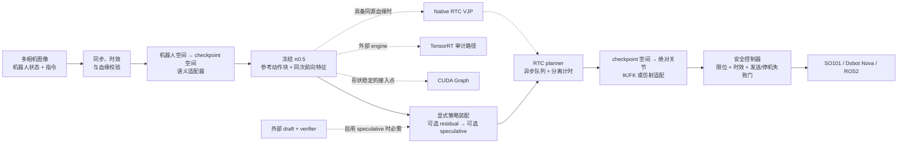

# Fibocom π0.5 VLA Stack

[English](README.md) | [简体中文](README_ZH.md)

**冻结基座的残差 RL 后训练 · 可审计的 VLA 推理加速 · Fail-closed 真机接入运行时**

本项目基于 [RLinf `release/v0.2`](https://github.com/RLinf/RLinf/tree/release/v0.2)，
面向具身基础模型的两个工程瓶颈：

1. 如何在保持 **π0.5** 基座权重冻结的前提下，用少量模型自采样经验完成
   参考动作锚定的后训练；
2. 如何把连续动作 VLA 推理组织成可度量、可异步覆盖、可安全接入机械臂的运行时。

> **当前验证等级：`component-verified`（2026-08-25）。** 本仓库已通过
> 131 项专项单元测试、16-step Mock 控制闭环，以及边界明确的 CUDA Graph
> 与 RTC 合成 GPU smoke；尚未在仿真器或真机上复现报告中的成功率和端到端
> π0.5 延迟。下文严格区分“外部报告值”“上游结果”“历史证据”和“本分支实测”。

## 项目概览

| 技术主线 | 本分支提供的实现 | 当前验证门 |
|---|---|---|
| **残差 RL 后训练** | π0.5 冻结边界、1.82M 级有界残差 actor、独立 V 网络、Twin-Q 辅助 critic、轨迹级 GAE、单轮 PPO、rollout 血缘 | 已实现 + 单测通过 |
| **CUDA Graph / TensorRT 诊断** | 形状稳定捕获、动态 eager 回退、严格等价性；TensorRT 配对计时、输出/逐层差异与 BF16/ULP 诊断 | CUDA Graph 合成 GPU 组件已验证；TensorRT 审计契约仅以 CPU fake 完成单测 |
| **连续动作 Speculative** | 整块 draft、插值路径批量验证、连续 prefix 接受、低接受率显式接管 | 已实现 + 单测通过；checkpoint 专用 draft/verifier 待接入 |
| **RTC 异步推理** | 执行/推理重叠、prefix 硬冻结、重叠区 VJP 引导、指数衰减权重、分离计时口径 | 合成 CUDA 组件已验证；OpenPI/真机待验证 |
| **机器人接入** | SO101、Dobot Nova TCP、通用 ROS2 关节控制、OpenCV/RealSense/ROS2 相机、语义适配与 fail-closed 安全门 | Mock 已验证；真机配置仍被 placeholder 锁定 |

## 总体架构



实线表示预期的逻辑接口；当前只有 Mock 路径真正执行过。真实 π0.5 与机器人端点
仍被 H=50 模型、运动学、标定和 SDK 值阻断。虚线表示受能力门控的可选加速路径。
当前 residual wrapper、speculative wrapper 和自定义非线性 IK/FK 边界无法端到端
证明 native RTC 血缘，因此会选择带显式标签的 host 输出空间 fallback，而不会把
后处理包装成去噪期 VJP。

## 1. 冻结 π0.5 的残差 RL 后训练

基座策略在同一次冻结前向中输出参考动作块和 2048-D 特征；轻量 actor 只学习
可行域内的局部修正：

```text
a_exec[t] = a_ref[t] + δθ(frozen_feature, a_ref)[t]
```

- **基座参数不可变：** π0.5 被强制置为 `eval()`，全部基座参数
  `requires_grad=False`，训练前检查意外解冻。该门保证权重不变，但尚未完成
  跨任务的基座能力保持评测。
- **RL Token 式映射：** 本项目将其实现为冻结 prefix、
  参考动作锚定的残差后训练；本分支不宣称已经接入独立的上游
  `RLTTokenTransformer` checkpoint。
- **1.82M 级 actor：** H=50、A=7、hidden=562 的 actor 精确包含
  **1,818,542 个可训练参数**；H=50、A=6、hidden=581 为 1,819,139。
  Twin-Q 与独立状态价值网络另行计数，不被藏在该数字中。
- **参考动作锚定：** 非对称残差边界同时考虑 `max_residual` 和最终动作域，避免
  事后静默 clipping 改变 behavior-policy likelihood。
- **干净的 PPO 血缘：** 每个动作记录 `action_source` 和 `policy_mask`。reference、
  guard、clamp、rescue、deterministic 与 padding 动作在合法时仍可训练 critic，
  但绝不污染 PPO 的 log-prob ratio。
- **二值任务结果 + 终止失败变换：** 输入是 chunk 级 `{0,1}`；第二次离散失败
  会被改写为可配置的 terminal penalty（默认 `-1`），后续尾部清零并 mask，使
  轨迹得到一个负的 terminal outcome。零 value baseline 单测验证了向前序传播的
  负优势；使用学习到的 `V(s)` 时，代码不会硬性保证 advantage 符号。因此变换后
  的训练 reward 并非纯二值，本代码也不反向证明历史 112-episode artifact 采用了
  同样的奖励语义。
- **语义清晰的混合目标：** 独立 `V(s)` 用于 GAE，Twin-Q 只作为显式加权的
  TD/actor 辅助目标，不使用 `min Q(s,a)` 冒充状态价值。`ppo_epochs` 固定为 1，
  对应声明的单轮更新。
- **可审计的残差血缘：** checkpoint 记录配置 hash、residual checkpoint SHA-256
  和操作者提供的不可变 base-model identity；rollout archive 必须与实际采样时的
  residual behavior-checkpoint hash 完全匹配后才能更新。CLI 不会独立加载或哈希
  π0.5 模型字节。

## 2. 推理运行时：Profiling、CUDA Graph 与 TensorRT

### 形状稳定的 CUDA Graph

`ShapeStableCUDAGraph` 只捕获声明过的 tensor tree signature。输入结构、shape、
stride、dtype、device 或非 tensor 参数任一变化都会切回 eager。等价性使用
`torch.equal` 严格判断，同时保留绝对/相对误差用于排查。这样可以把稳定子图与
动态分支明确拆开，而不是假设整条 VLA 链路都静态。

仓库内 benchmark 是刻意限定的 **synthetic MLP 组件 smoke**；生产 OpenPI
视觉/语言子图尚未接到该捕获工具上。

### TensorRT 证据路径

TensorRT 模块提供延迟依赖加载的 engine runner、配对计时、PyTorch 与 engine
最终输出/中间层结构和数值对齐、逐层比较和首差异定位，以及 BF16/ULP 风格诊断。
算子融合或舍入归因必须由外部 evidence marker 支持；本分支没有执行逐层 TensorRT
engine 消融。

本仓库当前**不包含** π0.5 exporter、engine builder，也没有已验证的 1.5× 部署结果。

## 3. 连续动作 Speculative Inference

本项目将离散 token speculation 改写为连续动作块协议：

1. draft policy 单次前向生成完整动作块；
2. 主策略通过 **B×K 并行 verifier** 批量评估 draft-to-main 插值路径上的候选点；
3. 只接受从头开始连续满足阈值的最长 prefix；
4. 被拒绝的 suffix 使用 verifier 产生的 `K` 个主模型 clean-action candidate
   的均值进行拼接。

当接受率坍缩时，本分支的可配置 override 执行 **同轮 full-main 接管**。诊断指标会将其
标记为本分支的显式 override，因为审阅到的 `realtime-vla-flash` 上游实现是在
下一轮调度 full inference，两种语义不会被混为一谈。

调度、prefix 契约、夹爪离散跳变能力门和 fallback 已实现并通过单测。仓库中尚无
checkpoint-bound π0.5 draft、归一化模型空间并行 verifier 或 production Triton
kernel；生产装配必须提供外部 factory，不会静默换成 mock policy。

## 4. RTC 异步推理

RTC planner 在当前动作块执行期间生成下一块，使动作执行窗口可以与模型计算重叠。
代码始终分别记录：

- 模型计算时间；
- planner 队列等待；
- 调用方等待 planner result 的阻塞时间（沿用 metric key `robot_wait_ms`），它不是
  物理机器人执行或 SDK blocking 时间；
- 端到端控制循环时间。

Native OpenPI RTC 从实际生成环境动作的同一次 forward 中保留归一化
`ActionChunk.model_values`。下一次请求会：

- 在每个去噪更新前后**硬冻结已承诺的动作 prefix**；
- 在模型空间把 overlap 与上一动作块对齐；
- 通过可微/VJP overlap objective 施加随位置指数衰减的权重；
- 在血缘、几何或能力声明不一致时 fail closed。

输出空间 blending 仅作为带明确名称的 host fallback，绝不会被报告为 native RTC。
如果在途 GPU/model forward 无法在超时内 join，planner shutdown 会明确失败；Python
线程“取消”不会被当作已经安全释放加速器上下文。

## 策略—机器人语义与安全边界

`PolicyRobotAdapterPolicy` 在推理前把机器人观测转换到 checkpoint 空间，并在
控制器接收动作前，把策略输出转换为绝对机器人关节目标。内置仿射适配器支持：

| `action_mode` | 第 `t` 步的策略空间绝对目标 |
|---|---|
| `absolute` | `a[t]` |
| `delta_from_observation` | `q_obs + a[t]` |
| `integrated_delta` | `q_obs + cumsum(a)[t]` |
| `velocity` | `q_obs + period_s * cumsum(a)[t]` |

目标返回前会检查 permutation、scale/offset、名称、单位、维度、控制周期、有限值、
关节限位、单步变化量与观测血缘。`end_effector` 和 `checkpoint_native` 坐标系必须
使用经审查的自定义 `module:function` 适配器，通用适配器拒绝猜测语义。

### 已实现的接口边界

- **SO101 / LeRobot：** 五个机械臂关节加夹爪。六维 Cartesian delta 不能直接
  改名为六个电机目标；7-D LIBERO 风格 checkpoint 需要任务专用 FK/IK 和夹爪转换。
- **Dobot Nova TCP/IP V4：** 六轴角度制 `ServoJ`、30004 feedback、可选二值 DO
  夹爪和独立 DI feedback，并检查 controller/collision、active-low SafetyState 与
  safety-skin approach 字段。
- **ROS2：** 标准 `sensor_msgs/JointState` 与
  `trajectory_msgs/JointTrajectory`；支持有确认的 Trigger 或 Dobot V4
  Stop/EmergencyStop service，并在 real mode 预检 endpoint。
- **相机：** OpenCV、RealSense、ROS2 `sensor_msgs/Image` 与 Mock。多相机读取共享
  一个全局 timeout，并通过 camera skew、freshness 和机器人/相机时间戳校验。

所有真机模板都从 `dry_run` 启动，并保留故意设置的 calibration/SDK placeholder。
真实写指令必须同时满足 `action_adapter.validated=true`、非 placeholder 的
calibration/kinematics/endpoint、完成物理限位核验后的
`limits_require_hardware_validation=false`、`robot.dry_run=false` 和 CLI
`--allow-motion`。Dry-run 会抑制目标、停止与急停写入；只改一个布尔值无法获得
真机运动权限。动作发布本身没有跨 backend 的通用 ACK；代码会在发送/响应异常时
fail closed，并要求已配置的 stop/emergency-stop service 返回确认。

## 本仓库当前实际证明了什么

| 范围 | 已观察证据 | 可以得出的结论 | 尚未证明 |
|---|---|---|---|
| CPU/单测 | 本地 Windows/Python 3.10 与远端 Linux 均 **131 passed**；Ruff/format/compile 通过 | 确定性组件契约与异常路径有效 | 策略质量或延迟 |
| Mock runtime | 16 个控制 step、2 个动作块、有界退出 | 观测→策略→控制器 plumbing | 仿真或真机成功率 |
| Actor 结构 | H=50×A=7 actor = **1,818,542** 参数 | 架构与参数量契约 | 这些参数带来的任务提升 |
| CUDA Graph | RTX 4080 SUPER 合成 FP16 MLP，bit-exact，均值 0.150132→0.050680 ms（**2.9623×**） | 该合成协议下捕获工具有效 | π0.5 的 48.2→42.8 ms |
| RTC VJP | 合成 CUDA 50×7 动作块；prefix bit-exact，5 个 VJP step，loss 0.376497→0.364270 | 通用 hard-prefix/autograd 机制 | OpenPI 延迟或机器人质量 |
| TensorRT | CPU fake + parity/逐层差异协议单测 | 审计契约 | π0.5 engine 运行/export、1.5×、逐层消融或 BF16 根因 |
| 真机接口 | SDK/API adapter、Mock 生命周期、fail-closed 门 | 接入边界已准备 | SO101/Nova/ROS2 实机验证 |

这些 GPU 数字只描述极小的独立合成组件，不能替代 checkpoint-bound 的端到端
benchmark。远端 artifact 绑定实现 commit `fb0d04a8`；后续变更必须重跑适用门，
才能继承这些执行结论。

<details>
<summary><strong>历史与外部指标的归属边界</strong></summary>

以下数字来自待审计的目标主张、历史工作或上游项目，**不是本分支已经复现的结果**：

| 数字 | 正确归属 / 当前阻塞项 |
|---|---|
| 报告的 112 条自采样轨迹、75.0%→96.9%、掉落减少 | 恢复出的 artifact 包含 80+32 条历史训练 episode，来自 reference/actor/heuristic 混合闭环策略，并非纯 actor 自采；另有 seed/guard/route 不同的 128-episode IsaacLab/Franka 仿真对比，没有 paired SO101/Nova 真机证据 |
| CUDA Graph 48.2→42.8 ms、bit-exact | 历史 StarVLA/Qwen 视觉路径证据，尚不能归到 π0.5 |
| TensorRT 1.5×、BF16 fusion 舍入 | 当前只有诊断假设/路径，没有 checkpoint-bound π0.5 engine 证据 |
| Speculative 58.0→19.1 ms、3.04×、平均成功率 −0.3 pp | 仅能确认为 FLASH 上游页面报告；本仓没有同协议复现 |
| 94.1%→93.8%、fallback 58.4%→84.6%、kernel 1.46×、algorithm 1.66× | 报告的精确值；已审阅来源中没有闭合的可复算原始证据 |
| RTC 5.6 s→4 ms、单次推理 76→97 ms | 外部报告值；计时语义与原始来源包仍未闭合，当前没有端到端本地复现 |

完整审计见[声明—证据边界](../../../docs/fibocom_vla_evidence/claim_boundary.md)。

</details>

## Quick Start：安全组件路径

先按 [RLinf 官方安装文档](https://rlinf.readthedocs.io/en/latest/rst_source/start/installation.html)
建立 Python 3.10/3.11 embodied 环境。从仓库根目录安装当前 checkout，并只补充
所选硬件 backend 实际需要的 SDK：

```bash
python -m pip install -e ".[embodied]"
```

LeRobot、Dobot V4 SDK、ROS2 包和相机驱动均按 backend 延迟加载，应从其官方
release/发行版安装；本示例不会静默安装这些真机依赖。

执行不会产生运动的检查：

```bash
python -m rlinf.projects.fibocom_vla.cli validate-config \
  --config examples/embodiment/fibocom_vla/config/mock.json

python -m rlinf.projects.fibocom_vla.cli actor-report \
  --config examples/embodiment/fibocom_vla/config/mock.json

python -m rlinf.projects.fibocom_vla.cli mock-smoke \
  --config examples/embodiment/fibocom_vla/config/mock.json \
  --steps 16

python -m pytest -q tests/unit_tests/projects/fibocom_vla
```

在 CUDA 主机上生成自描述的 **synthetic component** artifact：

```bash
PYTHONPATH=. python examples/embodiment/fibocom_vla/benchmark_cuda_graph.py \
  --output artifacts/cuda_graph_component.json \
  --batch-size 8 --width 256 --depth 4 --dtype float16 \
  --capture-warmup 3 --warmup 5 --repetitions 50
```

## 残差训练入口

在采集 rollout 前，先初始化 residual actor/Q/V 状态并记录 base-model identity：

```bash
python -m rlinf.projects.fibocom_vla.rl.train_cli initialize \
  --config examples/embodiment/fibocom_vla/config/so101_realsense.json \
  --output artifacts/residual_init.pt \
  --base-model pi0.5 \
  --base-model-revision YOUR_IMMUTABLE_PI05_CHECKPOINT_ID \
  --seed 17 --device cuda
```

collector 写出与该 checkpoint/config 绑定的 archive 后，执行声明的单轮更新：

```bash
python -m rlinf.projects.fibocom_vla.rl.train_cli update \
  --config examples/embodiment/fibocom_vla/config/so101_realsense.json \
  --input-checkpoint artifacts/residual_init.pt \
  --rollout artifacts/rollout.npz \
  --output artifacts/residual_updated.pt \
  --device cuda
```

配置 hash、已记录的 base model revision、residual behavior-checkpoint hash 或
rollout geometry 任一不匹配，都会在优化前被拒绝。`--base-model` 和
`--base-model-revision` 是操作者提供的 metadata；CLI 接受任意非空字符串，不会
加载或哈希 π0.5，因此必须把 `YOUR_IMMUTABLE_PI05_CHECKPOINT_ID` 替换为真实不可变
ID。以上两个命令只操作 residual checkpoint/archive，不会连接配置中命名的机器人。

## 接入你的 π0.5 资产

模型和 checkpoint 专用预处理语义不会被自动猜测。OpenPI 模型的
`action_horizon` 必须与 stack 完全一致。RLinf v0.2 自带 `pi05_libero` 为 H=10，
本项目残差示例为 H=50；`action_chunk` 只能截短输出，不能延长 checkpoint。
请注册真实 H=50 data/model config，不要只覆盖 metadata。

```bash
export FIBOCOM_PI05_MODEL_PATH=/absolute/path/to/pi05/checkpoint
export FIBOCOM_PI05_CONFIG_NAME=your_registered_pi05_h50_config
export FIBOCOM_PI05_DEVICE=cuda
export FIBOCOM_MAIN_CAMERA=main
export FIBOCOM_WRIST_CAMERA=wrist
export FIBOCOM_RESIDUAL_CHECKPOINT=artifacts/residual_updated.pt

# 仅 speculative.enabled=true 时需要：
export FIBOCOM_DRAFT_POLICY_FACTORY=your_package.factories:create_draft
export FIBOCOM_PARALLEL_VERIFIER_FACTORY=your_package.factories:create_verifier

python -m rlinf.projects.fibocom_vla.cli run \
  --config examples/embodiment/fibocom_vla/config/so101_realsense.json \
  --instruction "stack the red block on the blue block" \
  --steps 32
```

`FIBOCOM_RESIDUAL_CHECKPOINT` 必须保留 `train_cli` 同时生成的相邻 sidecar
`artifacts/residual_updated.pt.sha256`，缺失时会 fail closed。仓库内真机模板由
显式 validation、calibration、kinematics 和 limit gate 保持运动阻断；camera/topic/
SDK placeholder 字符串没有统一的 pattern check，可能在连接预检或首次 I/O 阶段失败，
必须人工逐项核验。首次接入请保持 `dry_run=true`，只做只读联调。

### 真机运动授权清单

任何物理写指令前必须：

1. 替换 serial/IP/topic/service placeholder，并验证 feedback freshness；
2. 绑定准确的 checkpoint camera/state/action 契约与 H=50 manifest；
3. 核验关节名称、顺序、单位、scale/offset、限位和控制周期；
4. 替换所有 calibration/kinematics/endpoint placeholder，设置
   `action_adapter.validated=true`，并仅在物理限位核验后设置
   `limits_require_hardware_validation=false`；
5. 对需要的任务安装并审查专用 FK/IK 与夹爪转换；
6. 先完成只读 dry-run，再在独立监护下使用 `robot.dry_run=false` 与
   `--allow-motion` 做有限步小范围运动测试；
7. Dobot 7-D 控制需设置 `gripper_feedback_backend=digital_input` 并验证独立 DI
   feedback；
8. 验证有确认的 stop/emergency-stop，并保证实体急停始终可触达。

## 代码地图

```text
rlinf/projects/fibocom_vla/
├── rl/          残差 actor、V/Twin-Q、二值结果变换、GAE/PPO、rollout 封存
├── inference/   profiling、CUDA Graph、speculative、RTC、TensorRT 诊断
├── hardware/    语义/运动学适配器、SO101、Dobot、ROS2、相机
├── runtime/     同步控制、安全门、计时与生命周期
├── factories.py fail-closed π0.5 / residual / speculative 装配
└── cli.py       配置检查、actor 报告、Mock smoke、有限步运行

examples/embodiment/fibocom_vla/
├── config/      Mock 与被锁定的真机模板
├── schema/      action-adapter JSON schema
└── benchmark_cuda_graph.py

docs/fibocom_vla_evidence/
├── claim_boundary.md
├── reproduction_matrix.csv
├── source_lock.json
├── local_validation_20260825.md
└── remote_validation_20260825.md
```

## 证据与已审阅来源

- [声明—证据边界](../../../docs/fibocom_vla_evidence/claim_boundary.md)
- [复现矩阵](../../../docs/fibocom_vla_evidence/reproduction_matrix.csv)
- [本地验证记录](../../../docs/fibocom_vla_evidence/local_validation_20260825.md)
- [远端 CUDA 组件记录](../../../docs/fibocom_vla_evidence/remote_validation_20260825.md)
- [固定来源身份](../../../docs/fibocom_vla_evidence/source_lock.json)

| 来源 | 审阅 revision | 用途 |
|---|---|---|
| [RLinf](https://github.com/RLinf/RLinf) | `release/v0.2` / `46213e88` | 实现基座；OpenPI 与 RL 契约 |
| RLinf main | `230ea79b` | 仅用于兼容性对比 |
| [FlashRT](https://github.com/flashrt-project/FlashRT) | `f72192b2` | capture/exactness 与 runtime 设计审计 |
| [realtime-vla-flash](https://github.com/dexmal/realtime-vla-flash) | `da6cecca` | 连续 draft、并行验证、prefix 与 RTC 审计 |
| [LeRobot](https://github.com/huggingface/lerobot) | `v0.4.4` / `8fff0fde` | SO101 API 契约 |
| [Dobot TCP/IP V4](https://github.com/Dobot-Arm/TCP-IP-Python-V4) | `55ec1ec8` | Nova 直连控制契约 |
| [Dobot ROS2 V4](https://github.com/Dobot-Arm/DOBOT_6Axis_ROS2_V4) | `def21d05` | ROS2 stop/emergency 契约 |

## 后续集成里程碑

- 绑定并冻结真实 π0.5 H=50 checkpoint/config manifest；
- 接入 checkpoint 专用 OpenPI 视觉子图，并执行 AB/BA 配对延迟与等价性测试；
- 完成 π0.5 TensorRT export/build/runtime selection；
- 提供 checkpoint-bound draft 与归一化模型空间 verifier；
- 在引用成功率前完成同 reset/seed 的 paired simulator 评测；
- 完成 SO101/Nova 只读、有限运动与任务级验证。

本项目沿用父仓库的 [Apache-2.0 License](../../../LICENSE)。核心原则是：
**“代码路径存在”“上游报告过数字”“本仓完成复现”是三件不同的事**，每一项都必须
保留自己的证据血缘。
